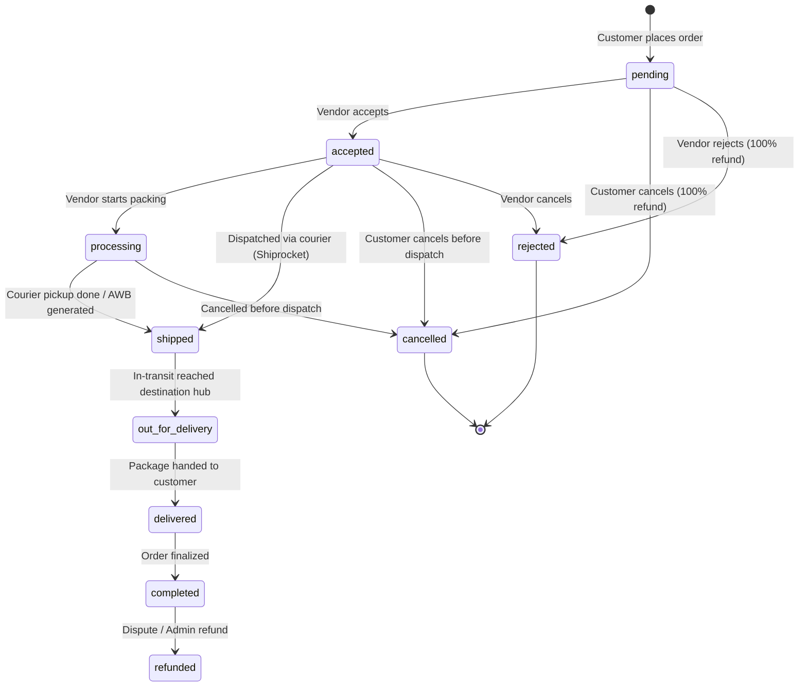

# BizReels — Complete Order Flow & Shipping Architecture
## Android Developer Integration & API Specification Guide

> **Target Audience:** Android App Developers (Kotlin / Jetpack Compose / Retrofit / Ktor)  
> **Backend Version:** BizReels Core Engine v1.0  
> **Last Updated:** 2026-09-05  
> **Status:** Production Ready  

---

## 1. Architecture & Executive Summary

BizReels provides a unified commerce and service engine supporting two distinct purchase types:
1. **Physical Product Orders** (e-commerce items with stock decrement, automated Shiprocket fulfillment, and live courier tracking).
2. **Service Bookings** (appointment slots with double-booking prevention, time-slot locking, and tiered cancellation refund policies).

### Key Technical Pillars Built into Backend:
- **Immutable Item Snapshotting:** When an order is placed, an immutable snapshot (`itemSnapshot`) of title, images, sku, unit price, shop name, and variant details is permanently frozen into the order. If the seller later edits or deletes the original listing, the customer and vendor order receipts remain 100% intact.
- **Idempotency Guarantee:** The Android app can safely retry order placement requests on flaky 4G/5G connections using an `Idempotency-Key` HTTP header. Duplicate network transmissions return the existing order without charging the user or decrementing stock twice.
- **Strict State Machine:** Order transitions are strictly enforced on the server. Illegal jumps (e.g. `cancelled` → `shipped` or `delivered` → `pending`) are blocked with HTTP 400.
- **Automated Shiprocket Logistics:** As soon as an order is paid or accepted, the backend can auto-push the order to Shiprocket, generate an AWB tracking code, assign a courier, and track live status.
- **Tiered Cancellation & Wallet Auto-Refund:** Cancellation calculations and automated wallet debits/credits occur in real-time according to service policies or product dispatch status.

---

## 2. Base Configuration & Authentication

### Base URLs
- **Local / Emulator Dev:** `http://10.0.2.2:5000/api/v1` (Android Emulator default)
- **Local Device (Wi-Fi):** `http://<YOUR_LOCAL_IP>:5000/api/v1`
- **Production Server:** `https://api.bizreels.com/api/v1` *(replace with your production domain)*

### Standard HTTP Headers
```http
Authorization: Bearer <USER_JWT_TOKEN>
Content-Type: application/json
Accept: application/json
Idempotency-Key: <UUID_V4>   <-- (Required for POST /orders to prevent duplicate placement)
```

---

## 3. Complete Data Models & Kotlin Data Classes

Copy and paste these data classes directly into your Android project (`model/order/` package).

```kotlin
package com.bizreels.app.data.model.order

import com.google.gson.annotations.SerializedName

// ─── Standard API Envelope ──────────────────────────────────────
data class ApiResponse<T>(
    @SerializedName("success") val success: Boolean,
    @SerializedName("message") val message: String?,
    @SerializedName("data") val data: T?
)

data class ApiPaginatedResponse<T>(
    @SerializedName("success") val success: Boolean,
    @SerializedName("message") val message: String?,
    @SerializedName("data") val data: List<T>?,
    @SerializedName("pagination") val pagination: PaginationMeta?
)

data class PaginationMeta(
    @SerializedName("page") val page: Int,
    @SerializedName("limit") val limit: Int,
    @SerializedName("total") val total: Int,
    @SerializedName("totalPages") val totalPages: Int?
)

// ─── Order Entity ───────────────────────────────────────────────
data class OrderDto(
    @SerializedName("_id") val id: String,
    @SerializedName("customer") val customer: UserBriefDto?,
    @SerializedName("listing") val listing: ListingBriefDto?,
    @SerializedName("vendor") val vendor: UserBriefDto?,
    @SerializedName("quantity") val quantity: Int = 1,
    @SerializedName("price") val price: Double,
    @SerializedName("itemTotal") val itemTotal: Double = 0.0,
    @SerializedName("couponCode") val couponCode: String?,
    @SerializedName("couponDiscount") val couponDiscount: Double = 0.0,
    @SerializedName("shippingCharges") val shippingCharges: Double = 0.0,
    @SerializedName("pincode") val pincode: String?,
    @SerializedName("address") val address: String,
    @SerializedName("status") val status: String, // pending, accepted, processing, shipped, out_for_delivery, delivered, completed, cancelled, rejected, refunded
    @SerializedName("paymentStatus") val paymentStatus: String, // unpaid, paid
    @SerializedName("paymentMethod") val paymentMethod: String, // wallet, vendor_upi, vendor_qr, vendor_bank, cod, upi, cash
    @SerializedName("deliveryStatus") val deliveryStatus: String?,
    @SerializedName("trackingNumber") val trackingNumber: String?,
    @SerializedName("expectedDeliveryDate") val expectedDeliveryDate: String?,
    @SerializedName("bookingDate") val bookingDate: String?,
    @SerializedName("bookingTime") val bookingTime: String?,
    @SerializedName("scheduledVisitTime") val scheduledVisitTime: String?,
    @SerializedName("cancellationReason") val cancellationReason: String?,
    @SerializedName("cancelledAt") val cancelledAt: String?,
    @SerializedName("refundAmount") val refundAmount: Double = 0.0,
    @SerializedName("refundPercentage") val refundPercentage: Double = 0.0,
    @SerializedName("itemSnapshot") val itemSnapshot: ItemSnapshotDto?,
    @SerializedName("shiprocketDetails") val shiprocketDetails: ShiprocketDetailsDto?,
    @SerializedName("createdAt") val createdAt: String,
    @SerializedName("updatedAt") val updatedAt: String
)

// ─── Immutable Item Snapshot (Use for Order Receipts) ───────────
data class ItemSnapshotDto(
    @SerializedName("title") val title: String?,
    @SerializedName("sku") val sku: String?,
    @SerializedName("unitPrice") val unitPrice: Double = 0.0,
    @SerializedName("images") val images: List<String> = emptyList(),
    @SerializedName("variantDetails") val variantDetails: Map<String, Any>?,
    @SerializedName("vendorShopName") val vendorShopName: String?,
    @SerializedName("vendorId") val vendorId: String?,
    @SerializedName("category") val category: String?,
    @SerializedName("listingType") val listingType: String? // "product" or "service"
)

// ─── Shiprocket Logistics Details ──────────────────────────────
data class ShiprocketDetailsDto(
    @SerializedName("orderId") val orderId: String?,
    @SerializedName("shipmentId") val shipmentId: String?,
    @SerializedName("awbCode") val awbCode: String?,
    @SerializedName("courierCompanyId") val courierCompanyId: Int?,
    @SerializedName("courierName") val courierName: String?,
    @SerializedName("labelUrl") val labelUrl: String?,
    @SerializedName("invoiceUrl") val invoiceUrl: String?,
    @SerializedName("pickupScheduledDate") val pickupScheduledDate: String?,
    @SerializedName("pickupTokenNumber") val pickupTokenNumber: String?,
    @SerializedName("syncStatus") val syncStatus: String?, // "not_applicable", "pending", "synced", "shipping_sync_failed"
    @SerializedName("lastSyncError") val lastSyncError: String?,
    @SerializedName("trackingStatus") val trackingStatus: String?
)

// ─── Live Tracking Response ────────────────────────────────────
data class OrderTrackingData(
    @SerializedName("orderId") val orderId: String,
    @SerializedName("trackingNumber") val trackingNumber: String?,
    @SerializedName("status") val status: String,
    @SerializedName("deliveryStatus") val deliveryStatus: String?,
    @SerializedName("shiprocketDetails") val shiprocketDetails: ShiprocketDetailsDto?,
    @SerializedName("liveTracking") val liveTracking: LiveTrackingDetails?
)

data class LiveTrackingDetails(
    @SerializedName("track_status") val trackStatus: Int?,
    @SerializedName("shipment_status") val shipmentStatus: String?,
    @SerializedName("shipment_track") val shipmentTrack: List<ShipmentTrackActivity>?,
    @SerializedName("shipment_track_activities") val activities: List<TrackingActivity>?
)

data class ShipmentTrackActivity(
    @SerializedName("id") val id: Long?,
    @SerializedName("current_status") val currentStatus: String?,
    @SerializedName("delivered_to") val deliveredTo: String?,
    @SerializedName("destination") val destination: String?,
    @SerializedName("origin") val origin: String?,
    @SerializedName("courier_name") val courierName: String?,
    @SerializedName("edd") val edd: String?
)

data class TrackingActivity(
    @SerializedName("date") val date: String?,
    @SerializedName("status") val status: String?,
    @SerializedName("activity") val activity: String?,
    @SerializedName("location") val location: String?,
    @SerializedName("sr-status-label") val statusLabel: String?
)

// ─── User & Listing Briefs ─────────────────────────────────────
data class UserBriefDto(
    @SerializedName("_id") val id: String,
    @SerializedName("name") val name: String?,
    @SerializedName("email") val email: String?,
    @SerializedName("phone") val phone: String?,
    @SerializedName("avatarUrl") val avatarUrl: String?,
    @SerializedName("vendorProfile") val vendorProfile: VendorProfileBrief?
)

data class VendorProfileBrief(
    @SerializedName("shopName") val shopName: String?,
    @SerializedName("businessName") val businessName: String?,
    @SerializedName("city") val city: String?
)

data class ListingBriefDto(
    @SerializedName("_id") val id: String,
    @SerializedName("title") val title: String?,
    @SerializedName("images") val images: List<Any>?,
    @SerializedName("type") val type: String?,
    @SerializedName("category") val category: String?,
    @SerializedName("price") val price: Double?,
    @SerializedName("sellingPrice") val sellingPrice: Double?,
    @SerializedName("stock") val stock: Int?
)

// ─── Request Payloads ──────────────────────────────────────────
data class CreateOrderRequest(
    @SerializedName("listingId") val listingId: String,
    @SerializedName("quantity") val quantity: Int = 1,
    @SerializedName("address") val address: String,
    @SerializedName("pincode") val pincode: String = "",
    @SerializedName("paymentMethod") val paymentMethod: String = "vendor_upi", // wallet, vendor_upi, cod
    @SerializedName("paymentDetails") val paymentDetails: Map<String, Any>? = null,
    @SerializedName("couponCode") val couponCode: String? = null,
    @SerializedName("couponDiscount") val couponDiscount: Double = 0.0,
    @SerializedName("shippingCharges") val shippingCharges: Double = 0.0,
    @SerializedName("shippingDetails") val shippingDetails: Map<String, Any>? = null,
    @SerializedName("bookingDate") val bookingDate: String? = null, // "YYYY-MM-DD" for service
    @SerializedName("bookingTime") val bookingTime: String? = null, // "10:00 AM - 12:00 PM"
    @SerializedName("scheduledVisitTime") val scheduledVisitTime: String? = null, // ISO8601
    @SerializedName("idempotencyKey") val idempotencyKey: String? = null
)

data class CalculateShippingRequest(
    @SerializedName("deliveryPincode") val deliveryPincode: String,
    @SerializedName("pickupPincode") val pickupPincode: String = "110001",
    @SerializedName("orderAmount") val orderAmount: Double,
    @SerializedName("weight") val weight: Double = 0.5,
    @SerializedName("isCod") val isCod: Boolean = false
)

data class ShippingRateData(
    @SerializedName("shippingFee") val shippingFee: Double,
    @SerializedName("originalFee") val originalFee: Double,
    @SerializedName("isFree") val isFree: Boolean,
    @SerializedName("courierName") val courierName: String?,
    @SerializedName("estimatedDays") val estimatedDays: String?,
    @SerializedName("isServiceable") val isServiceable: Boolean
)

data class UpdateOrderStatusRequest(
    @SerializedName("status") val status: String? = null,
    @SerializedName("deliveryStatus") val deliveryStatus: String? = null,
    @SerializedName("trackingNumber") val trackingNumber: String? = null,
    @SerializedName("expectedDeliveryDate") val expectedDeliveryDate: String? = null,
    @SerializedName("paymentStatus") val paymentStatus: String? = null,
    @SerializedName("notes") val notes: String? = null,
    @SerializedName("rejectionReason") val rejectionReason: String? = null
)

data class CancelOrderRequest(
    @SerializedName("reason") val reason: String
)
```

---

## 4. State Machine & Lifecycle Transitions

The backend enforces strict forward-only transitions. Use this diagram for UI action buttons (e.g. show/hide "Cancel", "Mark Shipped", "Confirm Delivery").

### Product Lifecycle (E-Commerce Items)



### Allowed State Transitions Table

| Current Status | Allowed Next Statuses | Who Can Trigger? | Rules / Notes |
| :--- | :--- | :--- | :--- |
| **`pending`** | `accepted`, `cancelled`, `rejected` | Customer (cancel), Vendor (accept/reject) | Stock was locked at creation. If cancelled, stock restored. |
| **`accepted`** | `processing`, `shipped`, `completed`, `cancelled`, `rejected` | Vendor, Shiprocket Webhook, Customer (cancel) | Customer can cancel here only if not yet handed to courier. |
| **`processing`** | `shipped`, `completed`, `cancelled` | Vendor, Shiprocket Webhook | Order is packed and waiting for courier pickup. |
| **`shipped`** | `out_for_delivery`, `delivered` | Vendor, Shiprocket Webhook | **Customer CANNOT cancel once shipped.** |
| **`out_for_delivery`** | `delivered`, `cancelled` (RTO) | Courier Webhook, Vendor | Courier delivery agent on the way. |
| **`delivered`** | `completed`, `refunded` | System, Admin, Vendor | If COD order, paymentStatus switches to `paid`. |
| **`completed`** | `refunded` | Admin | Terminal state for happy path. |
| **`cancelled`** | *Terminal (None)* | - | Terminal state. Wallet refund processed if paid. |
| **`rejected`** | *Terminal (None)* | - | Terminal state. Vendor rejected order. |
| **`refunded`** | *Terminal (None)* | - | Terminal state. Money credited to customer wallet. |

---

## 5. End-to-End API Reference

### 5.1 Calculate Shipping Rate
Use this API on the Checkout screen when the user enters or changes their delivery PIN code.

- **URL:** `POST /api/v1/offers/calculate-shipping`
- **Auth:** Required (`Bearer <token>`)
- **Request Body:**
```json
{
  "deliveryPincode": "560001",
  "pickupPincode": "110001",
  "orderAmount": 650,
  "weight": 0.5,
  "isCod": false
}
```
- **Response (200 OK):**
```json
{
  "success": true,
  "data": {
    "shippingFee": 0,
    "originalFee": 40,
    "isFree": true,
    "courierName": "Shiprocket Surface Express",
    "estimatedDays": "2-4 business days",
    "isServiceable": true
  }
}
```
> **Business Rule:** Orders with subtotal $\ge$ ₹499 qualify for **FREE SHIPPING** (`shippingFee = 0`). Below ₹499, standard freight charges apply (typically ₹40 or calculated courier rate).

---

### 5.2 Create Order (Direct Buy / Service Booking)
Use this API when a customer taps "Buy Now" or "Book Service".

- **URL:** `POST /api/v1/orders`
- **Auth:** Required (`Bearer <token>`)
- **Headers:** `Idempotency-Key: 8f4a1c52-75d3-4f9e-a4b7-9812e9b01234`
- **Request Body (Physical Product):**
```json
{
  "listingId": "66d8f1e29c8b3e0012345678",
  "quantity": 1,
  "address": "Flat 402, Sunshine Heights, Koramangala 4th Block, Bengaluru, Karnataka",
  "pincode": "560034",
  "paymentMethod": "vendor_upi",
  "paymentDetails": {
    "utr": "425167891234",
    "payerUpi": "customer@oksbi"
  },
  "couponCode": "WELCOME10",
  "couponDiscount": 50,
  "shippingCharges": 0,
  "idempotencyKey": "8f4a1c52-75d3-4f9e-a4b7-9812e9b01234"
}
```

- **Request Body (Service Booking):**
```json
{
  "listingId": "66d8f1e29c8b3e0098765432",
  "quantity": 1,
  "address": "Customer doorstep address",
  "pincode": "110001",
  "bookingDate": "2026-09-10",
  "bookingTime": "11:00 AM - 01:00 PM",
  "scheduledVisitTime": "2026-09-10T05:30:00.000Z",
  "paymentMethod": "wallet"
}
```

- **Response (201 Created):**
```json
{
  "success": true,
  "message": "Order placed successfully.",
  "data": {
    "order": {
      "_id": "6701a2b3c4d5e6f7a8b9c0d1",
      "customer": "66d0a1b2c3d4e5f6a7b8c9d0",
      "listing": "66d8f1e29c8b3e0012345678",
      "vendor": "66cf9876543210abcdef0123",
      "quantity": 1,
      "price": 450,
      "itemTotal": 500,
      "couponCode": "WELCOME10",
      "couponDiscount": 50,
      "shippingCharges": 0,
      "status": "pending",
      "paymentStatus": "unpaid",
      "paymentMethod": "vendor_upi",
      "deliveryStatus": "pending",
      "address": "Flat 402, Sunshine Heights, Koramangala 4th Block, Bengaluru, Karnataka",
      "pincode": "560034",
      "itemSnapshot": {
        "title": "Pure Organic Cotton Oversized Tee",
        "sku": "TEE-BLK-L",
        "unitPrice": 500,
        "images": ["https://res.cloudinary.com/bizreels/image/upload/sample.jpg"],
        "vendorShopName": "Urban Vogue Studio",
        "vendorId": "66cf9876543210abcdef0123",
        "category": "Apparel",
        "listingType": "product"
      },
      "shiprocketDetails": {
        "syncStatus": "pending"
      },
      "createdAt": "2026-09-05T00:15:00.000Z"
    }
  }
}
```

> **Idempotency Replay (HTTP 200):** If the network retries with the same `Idempotency-Key`, the backend returns `isReplay: true` and the existing order without duplicate debiting or stock decrement.

---

### 5.3 Get Orders List (Customer / Vendor)
- **URL:** `GET /api/v1/orders`
- **Auth:** Required (`Bearer <token>`)
- **Query Parameters:**
  - `status` (Optional): `active`, `pending`, `accepted`, `shipped`, `delivered`, `cancelled`
  - `paymentStatus` (Optional): `paid`, `unpaid`
  - `search` (Optional): Order ID or item title query
  - `page` (Optional, default `1`)
  - `limit` (Optional, default `10`)
- **Response (200 OK):**
```json
{
  "success": true,
  "message": "Orders retrieved successfully.",
  "data": [
    {
      "_id": "6701a2b3c4d5e6f7a8b9c0d1",
      "status": "shipped",
      "price": 450,
      "quantity": 1,
      "trackingNumber": "SR1234567890IN",
      "deliveryStatus": "shipped",
      "itemSnapshot": {
        "title": "Pure Organic Cotton Oversized Tee",
        "unitPrice": 500,
        "images": ["https://res.cloudinary.com/bizreels/image/upload/sample.jpg"],
        "vendorShopName": "Urban Vogue Studio"
      },
      "createdAt": "2026-09-05T00:15:00.000Z"
    }
  ],
  "pagination": {
    "page": 1,
    "limit": 10,
    "total": 1,
    "totalPages": 1
  }
}
```

---

### 5.4 Get Order Details by ID
- **URL:** `GET /api/v1/orders/:id`
- **Auth:** Required (`Bearer <token>`)
- **Response (200 OK):**
Returns the complete populated `Order` object with `customer`, `vendor`, `listing`, `itemSnapshot`, and `shiprocketDetails`.

---

### 5.5 Live Order Tracking (Shiprocket Courier Milestones)
Use this API for the "Track Order" button / screen.

- **URL:** `GET /api/v1/orders/:id/track`
- **Auth:** Required (`Bearer <token>`)
- **Response (200 OK):**
```json
{
  "success": true,
  "message": "Tracking details retrieved successfully.",
  "data": {
    "orderId": "6701a2b3c4d5e6f7a8b9c0d1",
    "trackingNumber": "SR9876543210IN",
    "deliveryStatus": "out_for_delivery",
    "status": "out_for_delivery",
    "shiprocketDetails": {
      "orderId": "5123901",
      "shipmentId": "5098214",
      "awbCode": "SR9876543210IN",
      "courierName": "Delhivery Surface",
      "pickupScheduledDate": "2026-09-05T09:00:00.000Z",
      "syncStatus": "synced",
      "trackingStatus": "OUT FOR DELIVERY"
    },
    "liveTracking": {
      "track_status": 1,
      "shipment_status": "OUT FOR DELIVERY",
      "shipment_track": [
        {
          "current_status": "OUT FOR DELIVERY",
          "courier_name": "Delhivery Surface",
          "edd": "2026-09-06"
        }
      ],
      "shipment_track_activities": [
        {
          "date": "2026-09-05 08:30:00",
          "status": "OFD",
          "activity": "Out for delivery with rider Amit Sharma (OTP: 4821)",
          "location": "Bengaluru Hub, HSR Layout"
        },
        {
          "date": "2026-09-04 22:15:00",
          "status": "RAD",
          "activity": "Reached Destination Facility",
          "location": "Bengaluru Hub"
        },
        {
          "date": "2026-09-03 14:00:00",
          "status": "IT",
          "activity": "In Transit from Origin Facility",
          "location": "New Delhi Central Hub"
        },
        {
          "date": "2026-09-02 18:00:00",
          "status": "PU",
          "activity": "Shipment picked up from vendor warehouse",
          "location": "New Delhi"
        }
      ]
    }
  }
}
```

---

### 5.6 Cancel Order (Customer or Vendor)
- **URL:** `PATCH /api/v1/orders/:id/cancel`
- **Auth:** Required (`Bearer <token>`)
- **Request Body:**
```json
{
  "reason": "Ordered by mistake, want to change color/size"
}
```
- **Response (200 OK):**
```json
{
  "success": true,
  "message": "Cancellation processed successfully. Standard 100% full cancellation (₹450 refunded).",
  "data": {
    "order": {
      "_id": "6701a2b3c4d5e6f7a8b9c0d1",
      "status": "cancelled",
      "deliveryStatus": "cancelled",
      "refundAmount": 450,
      "refundPercentage": 100,
      "cancelledAt": "2026-09-05T01:00:00.000Z",
      "cancellationReason": "Ordered by mistake, want to change color/size"
    }
  }
}
```

#### Cancellation Rules Matrix:
1. **Product Orders:**
   - Allowed when status is `pending` or `accepted`.
   - **Blocked with HTTP 400** if status is `shipped`, `out_for_delivery`, or `delivered`.
   - 100% refund credited automatically to user's Wallet if `paymentStatus == 'paid'`.
2. **Service Bookings:**
   - $\ge$ 24 hours before visit time: **100% Refund**.
   - Within 24 hours before visit time: **50% Refund**.
   - After scheduled visit time: **0% Refund**.

---

### 5.7 Update Order Status (Vendor Only)
Used by the vendor on the Vendor Orders Dashboard to accept, pack, or update tracking.

- **URL:** `PATCH /api/v1/orders/:id/status`
- **Auth:** Required (`Bearer <token>` of vendor/admin)
- **Request Body (Accept Order):**
```json
{
  "status": "accepted"
}
```
- **Request Body (Manual Tracking Update if Vendor uses self-shipping):**
```json
{
  "status": "shipped",
  "trackingNumber": "FEDEX123456",
  "expectedDeliveryDate": "2026-09-08T00:00:00.000Z"
}
```

---

### 5.8 Manual Shiprocket Fulfillment Sync (Vendor/Admin)
If an order's shipping sync was delayed or failed, the vendor can tap "Retry Shipping Sync".

- **URL:** `POST /api/v1/orders/:id/shiprocket/sync`
- **Auth:** Required (`Bearer <token>`)
- **Response (200 OK):**
Returns updated order with generated `awbCode` and courier details.

---

### 5.9 Role-Switching Navigation Contract (Mobile App Integration)
When a user taps **Customer** or **Vendor** in the profile switcher drawer:

- **URL:** `PATCH /api/v1/auth/switch-role`
- **Request Body:**
```json
{
  "role": "customer" // or "vendor" or "creator"
}
```
- **Response (200 OK):**
```json
{
  "success": true,
  "message": "Switched to customer role successfully",
  "data": {
    "activeRole": "customer",
    "isOnboardingRequired": false,
    "targetOnboardingPath": "/onboarding/customer",
    "targetDashboardPath": "/customer/activities?tab=orders",
    "redirectTo": "/customer/activities?tab=orders"
  }
}
```
#### Android Routing Logic:
```kotlin
fun handleRoleSwitchResponse(context: Context, data: SwitchRoleData) {
    if (data.isOnboardingRequired) {
        // Redirect to Onboarding Activity / Composable
        when (data.activeRole) {
            "customer" -> navigateToCustomerOnboarding()
            "vendor" -> navigateToVendorOnboarding()
            "creator" -> navigateToCreatorOnboarding()
        }
    } else {
        // Redirect to the appropriate Dashboard / Tab
        when (data.activeRole) {
            "customer" -> navigateToCustomerActivities(tab = "orders")
            "vendor" -> navigateToVendorOrdersDashboard()
            "creator" -> navigateToCreatorStudio()
        }
    }
}
```

---

## 6. Retrofit 2 API Interface in Kotlin

Save this into `network/OrderApiService.kt`:

```kotlin
package com.bizreels.app.network

import com.bizreels.app.data.model.order.*
import retrofit2.Response
import retrofit2.http.*

interface OrderApiService {

    @POST("offers/calculate-shipping")
    suspend fun calculateShipping(
        @Body request: CalculateShippingRequest
    ): Response<ApiResponse<ShippingRateData>>

    @POST("orders")
    suspend fun createOrder(
        @Header("Idempotency-Key") idempotencyKey: String,
        @Body request: CreateOrderRequest
    ): Response<ApiResponse<Map<String, OrderDto>>>

    @GET("orders")
    suspend fun getOrders(
        @Query("status") status: String? = null,
        @Query("paymentStatus") paymentStatus: String? = null,
        @Query("search") search: String? = null,
        @Query("page") page: Int = 1,
        @Query("limit") limit: Int = 10
    ): Response<ApiPaginatedResponse<OrderDto>>

    @GET("orders/vendor/me")
    suspend fun getVendorOrders(
        @Query("status") status: String? = null,
        @Query("page") page: Int = 1,
        @Query("limit") limit: Int = 50
    ): Response<ApiPaginatedResponse<OrderDto>>

    @GET("orders/{id}")
    suspend fun getOrderById(
        @Path("id") orderId: String
    ): Response<ApiResponse<Map<String, OrderDto>>>

    @GET("orders/{id}/track")
    suspend fun trackOrder(
        @Path("id") orderId: String
    ): Response<ApiResponse<OrderTrackingData>>

    @PATCH("orders/{id}/status")
    suspend fun updateOrderStatus(
        @Path("id") orderId: String,
        @Body request: UpdateOrderStatusRequest
    ): Response<ApiResponse<Map<String, OrderDto>>>

    @PATCH("orders/{id}/cancel")
    suspend fun cancelOrder(
        @Path("id") orderId: String,
        @Body request: CancelOrderRequest
    ): Response<ApiResponse<Map<String, OrderDto>>>

    @POST("orders/{id}/shiprocket/sync")
    suspend fun syncShiprocket(
        @Path("id") orderId: String
    ): Response<ApiResponse<Map<String, Any>>>
}
```

---

## 7. Socket.IO Real-Time Order Events

The backend broadcasts live updates over WebSockets. Listen to these events so the customer and vendor order screens update instantly without pull-to-refresh:

```kotlin
// Initialize Socket.io client
val socket = IO.socket("https://api.bizreels.com")
socket.connect()

// Authenticate socket session with User ID
socket.emit("authenticate", JSONObject().put("userId", currentUserId))

// 1. Listen for Order Updates (Status, AWB, Delivery progression)
socket.on("order:updated") { args ->
    val orderJson = args[0] as JSONObject
    val updatedOrderId = orderJson.optString("_id")
    val newStatus = orderJson.optString("status")
    val awb = orderJson.optString("trackingNumber")
    
    // Refresh ViewModel state or show In-App Toast
    orderViewModel.onOrderUpdated(updatedOrderId, newStatus, awb)
}

// 2. Listen for Push Notifications
socket.on("notification:new") { args ->
    val notifJson = args[0] as JSONObject
    val title = notifJson.optString("title")
    val message = notifJson.optString("message")
    
    // Display Android System Notification or In-App Snackbar
    showLocalPushNotification(title, message)
}
```

---

## 8. Android Developer UI Implementation Checklist

| Step | Screen | UI Component / Action | Implementation Detail |
| :--- | :--- | :--- | :--- |
| **1** | **Checkout Screen** | PIN Code Entry | Trigger `POST /offers/calculate-shipping`. Display delivery ETA (e.g. `2-4 business days`) and `FREE SHIPPING` badge if $\ge$ ₹499. |
| **2** | **Checkout Screen** | Place Order Button | Generate `UUID.randomUUID().toString()` for `Idempotency-Key`. Send `POST /orders`. Disable button to prevent double-tap. |
| **3** | **Order Success** | Order Confirmation | Show Order ID, Item Title, Snapshot Image, and "Track Order" button. |
| **4** | **Customer Orders** | Order Card | Read item title and image from `itemSnapshot` first (fallback to `listing`). |
| **5** | **Order Detail** | Action Buttons | If `status in ['pending', 'accepted']`, show **"Cancel Order"** button. If `status in ['shipped', 'out_for_delivery']`, hide Cancel and show **"Track Order"** button. |
| **6** | **Track Order Modal**| Milestones Timeline | Call `GET /orders/:id/track`. Render vertical timeline connecting `PU` (Picked up) $\to$ `IT` (In transit) $\to$ `OFD` (Out for delivery) $\to$ `Delivered`. Show Courier name and AWB. |
| **7** | **Vendor Dashboard** | Order Actions | Show **"Accept Order"** and **"Reject Order"** when `pending`. Show **"Mark Shipped"** or **"Retry Shiprocket Sync"** when `accepted`. |

---

## 9. Contact & Backend Support
If you encounter any edge cases, missing fields, or custom courier requirements, reach out to the BizReels Backend Engineering Team.
