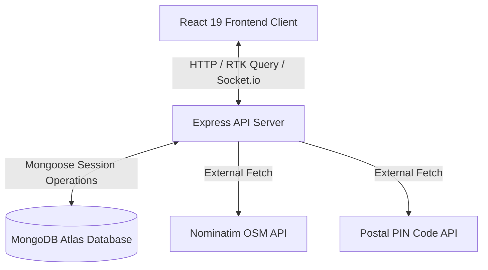
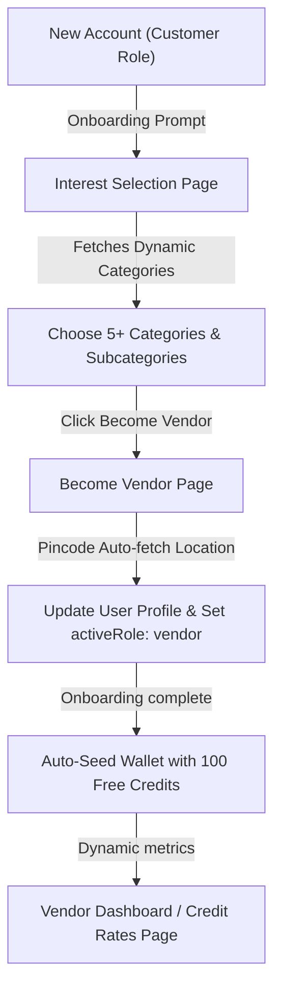

# BizReels — Local Social Commerce Platform (MERN Stack)

[](https://github.com/RDSSERVICE/BIZREELS.git)
[](https://bizreels.in)

BizReels is a production-ready, highly secure local social commerce platform tailored for the Indian marketplace. Discover local vendors, chat directly, negotiate fair deals, post requirements, browse localized reels, find nearby creators, and interact via interactive location maps.

---

## 🏗️ Project Architecture & Structure

```
BIZREELS/
├── backend/                  # Node.js & Express API Server
│   ├── src/
│   │   ├── config/           # Database, Passport.js, & integration configs
│   │   ├── controllers/      # Route controllers (Auth, Listings, Hires, Reels, etc.)
│   │   ├── middleware/       # JWT auth, role validation, rate limiters, error handling
│   │   ├── models/           # Mongoose schemas (24+ MongoDB database models)
│   │   ├── repositories/     # Data access layer
│   │   ├── routes/           # Express routes (/api/v1, /api, /v1, /auth aliases)
│   │   ├── services/         # Business logic & integrations (Razorpay, MSG91, Gemini AI)
│   │   ├── utils/            # ApiError, logger, helpers
│   │   └── app.js            # Express app setup, CORS, security headers, route mounting
│   ├── server.js             # HTTP server & Socket.io real-time gateway
│   └── package.json          # Node.js dependencies
│
├── frontend/                 # Vite + React 19 Frontend Application
│   ├── public/               # Static assets & Netlify _redirects configuration
│   ├── src/
│   │   ├── api/              # RTK Query Central API Slice
│   │   ├── components/       # Common UI elements & Google LocationPicker
│   │   ├── config/           # Environment & API URL configuration
│   │   ├── features/         # Feature-specific Redux slices & API endpoints
│   │   ├── lib/              # Axios client instance, tokenStore & Socket.io client
│   │   ├── pages/            # Application pages (Customer, Vendor, Creator, Admin)
│   │   ├── routes/           # React Router DOM routing
│   │   └── index.css         # Styling with Tailwind CSS
│   ├── vercel.json           # Vercel SPA route rewrite configuration
│   ├── vite.config.js        # Vite bundler, path aliases, & dev server proxy
│   └── package.json          # Frontend dependencies
│
└── vercel.json               # Root Vercel SPA routing configuration
```

---

## 📊 System Workflows & Data Flowcharts

### 1. General System Architecture & Communication
This chart illustrates the communication channels between the client frontend, backend API server, MongoDB database, and external verification/geocoding web services:



---

### 2. Onboarding, Role Switch & Wallet Seeding Flow
This chart describes a customer's journey: from selecting interest categories onboarding, switching to a vendor profile, auto-fetching location data, getting free welcome credits, to displaying live dynamic rates:



---

### 3. Optimized Location Fetching & Dual-Caching Pipeline
This chart details how incoming geocoding and pin-code requests are optimized using a high-speed memory cache and MongoDB coordinate caching to prevent slow RTT:

```mermaid
graph TD
    PIN["PIN Code Inputted"] -->|Check Length === 6| CheckMemoryCache{"Check In-Memory Pincodes"}
    CheckMemoryCache -->|Found (0ms)| SuccessPIN["Return City, District, State"]
    CheckMemoryCache -->|Not Found| CheckDBCache{"Check PincodeCache DB"}
    CheckDBCache -->|Found (<5ms)| SuccessPIN
    CheckDBCache -->|Not Found| ExternalPostalAPI["Call Postal PIN Code API"]
    ExternalPostalAPI -->|Write Cache| PincodeCacheDB[("PincodeCache Collection")]
    ExternalPostalAPI --> SuccessPIN

    Coord["GPS Coordinates (Lat/Lng)"] -->|Round to 3 Decimals| CheckGeocodeCache{"Check GeocodeCache DB"}
    CheckGeocodeCache -->|Found (<5ms)| SuccessGeocode["Return Full Area Address"]
    CheckGeocodeCache -->|Not Found| Nominatim["Call Nominatim OSM API"]
    Nominatim -->|Write Cache| GeocodeCacheDB[("GeocodeCache Collection")]
    Nominatim --> SuccessGeocode
```

---

### 4. Wallet Credits Operations & Consumption Rate Verification
This chart outlines how credit rates are dynamically fetched from settings cache and deducted securely via database transactions when a vendor performs a paid action:

```mermaid
graph TD
    Action["Publish Product / Reveal Lead / Post Reel"] --> CheckRates{"Get Credit Consumption Rates"}
    CheckRates -->|Read from Memory Cache| Consume["Fetch dynamic rate values"]
    CheckRates -->|Expired Cache (>30s)| DB[("Query AppSettings 'credit_rates'")]
    DB --> Consume
    Consume --> VerifyBalance{"Verify available wallet balance"}
    VerifyBalance -->|Insufficient| Error["Return 402 Error / Block Action"]
    VerifyBalance -->|Sufficient| Debit["Perform Mongoose session transaction debit"]
    Debit --> SyncUser["Sync User walletBalance"]
    Debit --> CreateLog["Write WalletTransactionV2 success log"]
    Debit --> LiveUpdate["Emit Socket.io event for real-time wallet UI refresh"]
```

---

## ⚡ Key Features & Technical Highlights

1. **Multi-Role User Portals**:
   - **Customer Portal**: Search local listings, view interactive map pins, post requirements, chat with vendors, and browse local reels.
   - **Vendor Studio**: Manage product & service listings, boost visibility, track leads, handle orders, and hire local content creators.
   - **Creator Marketplace**: Showcase portfolio reels/photos, manage booking availability, receive vendor project orders, and manage creator wallet payouts.
   - **Admin Console**: Manage users, approve/takedown listings, moderate reported content, manage KYC queues, set commission rules, configure platform settings, and edit custom categories.

2. **Open Graph & Twitter Card Integration (SEO)**:
   - Dynamic meta tags and document titles hoisted natively using React 19 `<SEO>` component for high-quality social sharing.
   - Static search crawler fallbacks built directly in frontend `index.html`.
   - Domain migrated cleanly to **`bizreels.in`**.

3. **Dynamic Category & Subcategory Management**:
   - Removed all hardcoded category fallbacks across onboarding flows, vendor profiles, activities bookmarks, and posting requirements.
   - Category selections map dynamically to subcategories fetched from the admin database endpoints (`/v1/categories?tree=true`).
   - Dynamic icon renderer supporting image URLs, Unicode emojis, or fallback Lucide Icons seamlessly.

4. **Pincode Lookup Auto-fetch**:
   - Redundant "Lookup" buttons removed from vendor registration forms. Pincodes auto-fetch city, state, and district location details in the background as soon as a valid 6-digit Indian PIN Code is inputted.

5. **Location API Caching & Performance Optimizations**:
   - In-memory `COMMON_PINCODES` cache database resolves popular Indian pincodes instantly in **0ms**.
   - MongoDB coordinates cache (`GeocodeCache`) rounds coordinates to 3 decimal places (~100m accuracy) to retrieve reverse-geocoded addresses in under **5ms**, bypassing external API network limits.

6. **Parallelized Activity Count Queries**:
   - Optimized `/me/activity-counts` API by replacing slow, unindexed aggregation lookups (with string-to-ObjectId joins) with indexed parallel queries, reducing execution time from **644ms** to **<10ms**.

7. **Onboarding Credits & Live Wallet Breakdown**:
   - Automatic wallet creation and welcome credit allocation (**100 free credits**) seeded on signup/first vendor dashboard load, synchronized with User collection and tracked with `signup_bonus` transaction logs.
   - The Credit Balance Breakdown statistics are populated dynamically from live MongoDB wallet collections, showing real-time deposited, earned, and spent credits.

8. **Google Maps Integration**:
   - Integrated `LocationPicker` component using Google Maps JS & Places Autocomplete API.
   - Access key configured dynamically via `VITE_GOOGLE_MAPS_API_KEY`.

---

## 🚀 Local Setup & Development

### Prerequisites
- Node.js (version >= 18.0.0)
- MongoDB instance (local or MongoDB Atlas)

### 1. Backend Setup
```bash
cd backend

# Install dependencies
npm install

# Configure environment variables (.env)
# Set PORT=5000, MONGODB_URI, JWT_ACCESS_SECRET, etc.

# Start backend dev server
npm run dev
```
*The backend boots on `http://localhost:5000` with automatic DB initialization options.*

### 2. Frontend Setup
```bash
cd frontend

# Install dependencies
npm install

# Configure environment variables (.env)
VITE_GOOGLE_MAPS_API_KEY=your_google_maps_api_key_here
VITE_BACKEND_URL=
# (Leave VITE_BACKEND_URL empty in local dev to use Vite proxy automatically)

# Start frontend dev server
npm run dev
```
*The frontend boots up on `http://localhost:5173`.*

---

## 🌐 Deployment Instructions

### Backend (Render / Railway / Heroku)
1. Deploy the `backend/` folder to your Node.js hosting platform (e.g. Render).
2. Configure Environment Variables:
   - `NODE_ENV=production`
   - `PORT=5000`
   - `MONGODB_URI=<your-mongodb-connection-string>`
   - `CLIENT_URL=https://bizreels.in`
   - `JWT_ACCESS_SECRET=<secret>`
   - `JWT_REFRESH_SECRET=<secret>`
   - `GOOGLE_CLIENT_ID` & `GOOGLE_CLIENT_SECRET` (Optional)

### Frontend (Vercel)
1. Import the project repository on [Vercel](https://vercel.com).
2. Set **Root Directory** to `frontend`.
3. Build Command: `npm run build` | Output Directory: `dist`.
4. Configure Environment Variables in Vercel Dashboard:
   - `VITE_BACKEND_URL=https://your-backend.onrender.com`
   - `VITE_GOOGLE_MAPS_API_KEY=your_google_maps_api_key_here`
5. Deploy. All SPA routes (`/auth/login`, `/customer`, `/vendor`, `/creator`, `/admin`) will resolve cleanly without 404 errors.

---

## 🧪 Verification & Production Build

- **Build Frontend**:
  ```bash
  cd frontend
  npm run build
  ```
- **Run Backend Tests**:
  ```bash
  cd backend
  npm test
  ```

---

## 📄 Repository Information

- **GitHub Repository**: [https://github.com/RDSSERVICE/BIZREELS.git](https://github.com/RDSSERVICE/BIZREELS.git)
- **Branch**: `main`
