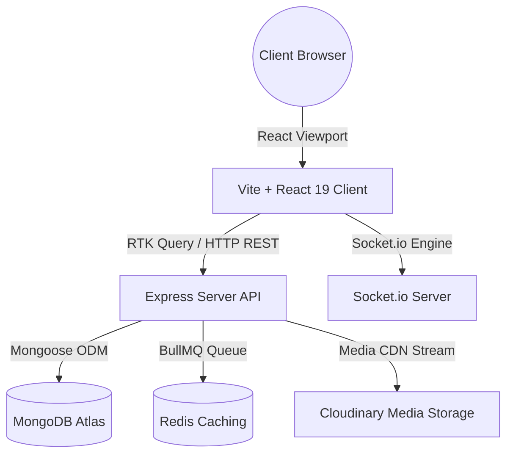

# BizReels System Architecture

This document describes the high-level system architecture of the **BizReels** platform, outlining module partitions, execution threads, and data synchronization triggers.

---

## 1. Modular Layout Overview

The platform uses a decoupled MERN architecture:



### Components Description
- **Vite + React 19 Frontend**: Handles glassmorphic responsive rendering and local state management using Redux Toolkit.
- **Node.js + Express Backend**: Directs endpoint routing, parses security validations (Helmet, Rate Limiter), and initiates database mutations.
- **MongoDB Atlas**: Serves as the primary transaction records database. Leverages 2dsphere geo-indexing for location proximity queries.
- **Redis Cache & BullMQ**: Directs background task dispatching (sponsor boosts expirations, notify schedules).
- **Socket.io**: Broadcaster relaying direct messaging, typing events, read receipts, and live stream chat scrolls.

---

## 2. Layered Coding Standards (MVC & Repository)

To optimize code reuse, maintain clean boundaries, and support test coverage:

```
Request Stream
  │
  ▼
[Routes Layer]        --> Mounts url paths & validates bodies (express-validator)
  │
  ▼
[Controller Layer]    --> Unwraps parameters, invokes matching services
  │
  ▼
[Service Layer]       --> Checks business validation rules, balance holds, triggers sockets
  │
  ▼
[Repository Layer]    --> Performs aggregation pipelines, transaction sessions, and DB reads
  │
  ▼
[Mongoose Schemas]    --> Assert database constraints, validations, and indexes
```

---

## 3. Real-Time WebSockets Sync

Sockets bindings mapping ensures real-time updates without polling:
- **`user:<userId>` room**: Active connection logs that receive quotes bidding updates, collaboration requests, and system alerts.
- **`conversation:<conversationId>` room**: Binds participants. Triggers message deliveries, active typing states, and seen updates.
- **Live Stream room**: Broadcasts comments text scrolling tickers, viewer tally updates, and liked float icons.

---

## 4. Double-Entry Wallet Ledger Escrow Design

To guarantee consistent balance calculations:
- Wallet changes use **Database Sessions Transactions** (`session.withTransaction`).
- Operations require matching opposite ledger entries (e.g. debiting buyer, crediting vendor, and writing transaction logs) to prevent budget leaks.
