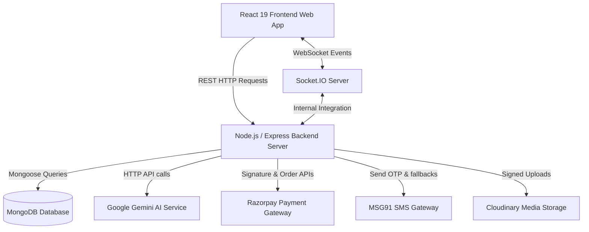

# System Architecture

BizReels is built on a modern, unified MERN (MongoDB, Express, React, Node.js) stack. The architecture is split into a client-side single-page application (SPA) and a RESTful backend API server that communicates over HTTP and WebSockets.

## Architectural Blueprint

## System Components

### 1. Frontend SPA (React 19)
* **Framework**: React 19 bootstrapped with Vite.
* **Styling**: Tailwind CSS for responsive components, customized Shadcn UI wrappers, Outfit (headings) and Manrope (body) typography.
* **State & Authentication**: Global context providers (e.g. `AuthContext.js`) manage active session variables and register global Socket.IO hooks.
* **Routing**: Declarative layout routes using React Router DOM.
* **Build Tooling**: Vite config compiles standard JSX within `.js` extension files using an esbuild loader.

### 2. Backend Server (Node.js & Express)
* **Framework**: Express API server structured with controllers, routers, services, and middlewares.
* **Real-time Server**: Integrated Socket.IO server running alongside the Node HTTP engine.
* **Task Scheduling**: Standard `node-cron` intervals manage deal expirations, requirement terminations, and vendor response rate calculations.
* **Security & Moderation**: Rate limits mapped using client IPs and resource signatures, gated routes checking JWT scopes, and sanitizing payloads with Joi.

### 3. Database Layer (MongoDB & Mongoose)
* **ORM**: Mongoose schemas map documents directly into MongoDB collections.
* **Legacy Compatibility**: Lowercase collection names (e.g. `users`, `listings`, `deals`) map directly to pre-existing schemas.
* **Spatial Indexing**: 2dsphere indexes applied to location coordinates (`location.geo`) support high-performance geospatial queries (finding listings near a user's location).

### 4. Real-time Communication (Socket.IO)
* **Authentication**: Handshakes utilize JWT payload parameters matching access token parameters.
* **Real-time Event Channels**:
  * `message:new` - Sends chat text, media, location, and system cards to active participants.
  * `deal:updated` - Dispatches deal state modifications, counter-offer adjustments, and acceptances.
  * `notification:new` - Delivers real-time push-like popups when listings are liked, comments are added, or listings are boosted.
  * `wallet:updated` - Synchronizes balance and credit modifications without manual page refreshes.
