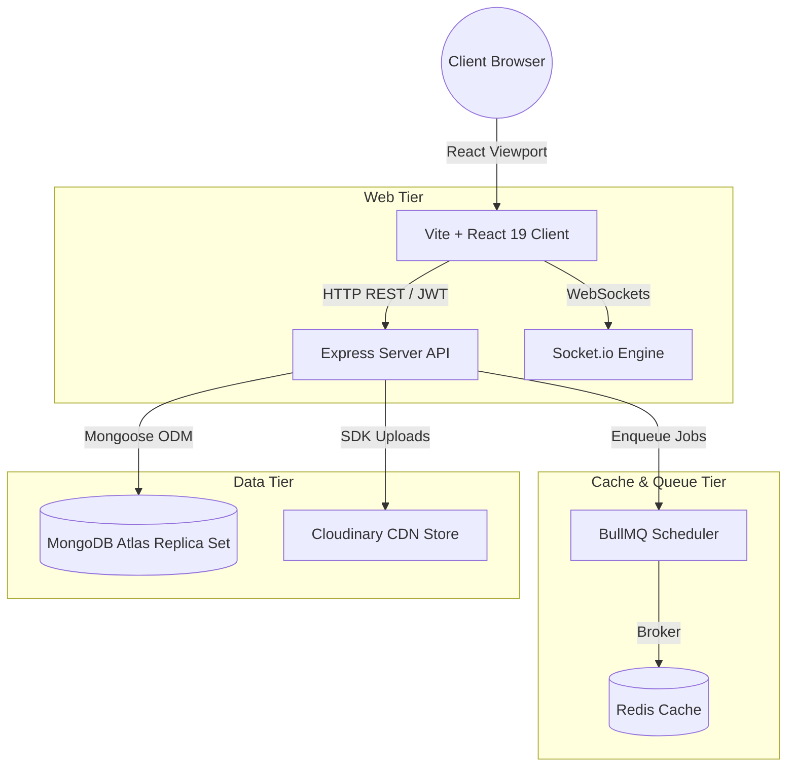
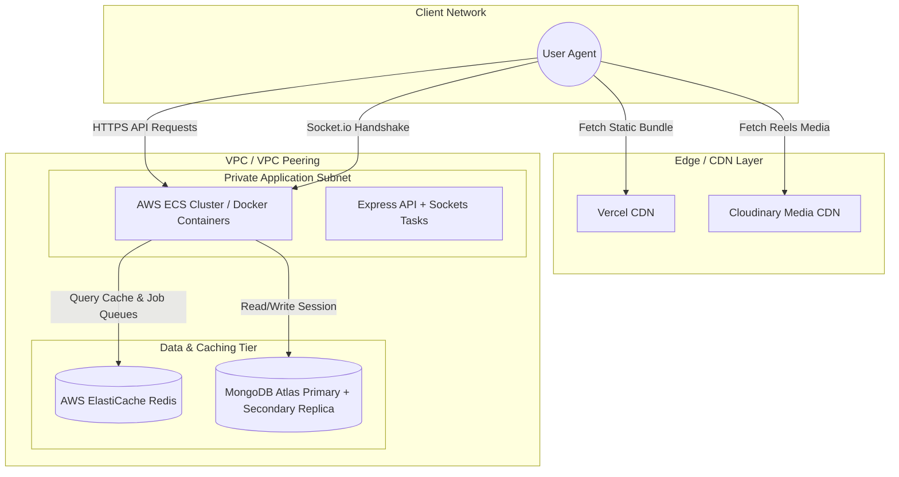

# High-Level System Architecture & Deployment Spec
## BizReels Marketplace Platform

---

## 1. High-Level Modular Overview

BizReels is built on a decoupled, MERN-based architectural layout. The system relies on a central Node.js Express REST API layer for business routing, a Socket.io server engine for real-time synchronization, and a Redis/BullMQ worker pipeline for background tasks.

---

## 2. Deployment Architecture Spec

The deployment architecture utilizes AWS ECS (Elastic Container Service) for container orchestration, Vercel/Netlify CDN for frontend asset delivery, and MongoDB Atlas for database replica-set reliability.

### 2.1 Component Environments Mapping
1. **Frontend Viewport**: Deployed as a static SPA bundle to Vercel. Requests are routed over SSL/TLS (HTTPS).
2. **Backend API Service**: Dockerized Express instance deployed behind an Application Load Balancer (ALB) on AWS ECS. Handles SSL termination.
3. **Real-time WebSockets Server**: Node.js Socket.io process co-located on the container cluster, mapped behind ALB sticky sessions (using HTTP long-polling fallback, upgrading to WebSockets protocol).
4. **Task Runner (BullMQ)**: Background node tasks executing on dedicated worker threads.
5. **Database Storage**: MongoDB Atlas cluster with georeplication enabled to guarantee read speeds on proximity listings.

---

## 3. Caching Strategy & Redis Schema

To optimize database load and sustain sub-200ms proximity query performance, BizReels implements a tiered caching strategy.

### 3.1 Rate Limit Caching
- **Implementation**: Utilizes `express-rate-limit` with `rate-limit-redis`.
- **Target**: Protects login, registry, and OTP validation routes.
- **Key Schema**: `limit:<IPAddress>:<EndpointPath>` (TTL: 15 minutes).

### 3.2 Proximity Query Caching
- **Implementation**: Geospatial queries (listings search matching coordinate blocks) are serialized and cached.
- **Key Schema**: `listings:near:lat:<latitude>:lng:<longitude>:rad:<radius>` (TTL: 5 minutes).
- **Eviction Trigger**: Automatically cleared when a new catalog listing is added in the respective coordinate grids.

### 3.3 Session Tokens Cache
- **Implementation**: Refresh tokens are registered in Redis. Used to handle instant logout revocations (Token Blacklisting).
- **Key Schema**: `blacklist:<RefreshTokenID>` (TTL: matching refresh token lifespan).
