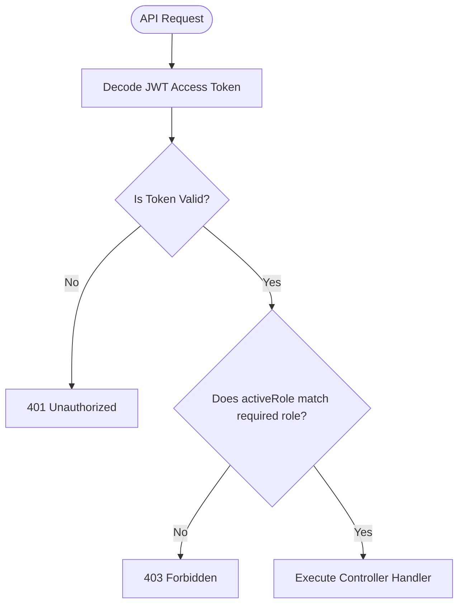

# Security Architecture Document
## BizReels Marketplace Platform

---

## 1. Authentication & Session Strategy

To prevent credential intercept vulnerabilities, BizReels implements a stateless JWT token rotation system coupled with stateful database validations.

```
[ CLIENT BROWSER ] 
  ├── Redux memory  <──  Access Token (Short-lived, 15m)  ──>  Used in HTTP Headers
  └── HttpOnly Cookie <── Refresh Token (Long-lived, 7d)  ──>  Used for POST /auth/refresh
```

### 1.1 Token Properties Spec

| Token Type | Lifespan | Storage Location | Security Configuration | Purpose |
|---|---|---|---|---|
| **Access Token** | 15 Minutes | In-Memory (Redux) | Sent via `Authorization: Bearer <token>` HTTP header. | Authenticates individual REST requests. |
| **Refresh Token** | 7 Days | HttpOnly, Secure Cookie | Path: `/api/v1/auth/refresh`, SameSite: `Strict`, Secure: `true`. | Dispatched only to refresh endpoint to request a new access token. |

### 1.2 Refresh Token Rotation (RTR) & Replay Prevention
When a refresh token is used, the backend issues a **new** refresh token and invalidates the old one. If an invalidated refresh token is presented again (indicating token theft/replay attack), the backend detects it, deletes all active sessions for that user ID, and forces a full re-login.

---

## 2. Role-Based Access Control (RBAC) & Authorization

BizReels leverages a multi-role system. A user can possess multiple roles simultaneously (`roles: ['customer', 'vendor']`), but acts under a single `activeRole` during a session.

### 2.1 Route Guarding Strategy



### 2.2 Server-Side Middleware Implementation

`activeRole` validation is enforced on all protected endpoints using custom middlewares:
- `authenticate`: Unwraps JWT, verifies validity, and loads user context into `req.user`.
- `authorizeRole(allowedRoles)`: Compares `req.user.activeRole` against the allowed roles array. If mismatch, throws a 403 Forbidden exception.

---

## 3. Financial Escrow Security & Audit Trails

To guarantee financial integrity and avoid balance manipulation:

1. **Transaction Isolation**: All wallet balance adjustments execute within database ACID transactions (`session.withTransaction`). If an escrow credit fails, the debit is rolled back automatically.
2. **Double-Entry Ledger Integrity**: Every balance adjustment must write matching entries in `WalletTransaction`:
   - *Debit Entry*: Deduct budget from sender, label category as `escrow_hold`.
   - *Credit Entry*: Credit budget to receiver on milestone completion, label category as `milestone_payout`.
3. **No Balance Mutations**: Direct mutations of `walletBalance` outside transaction logs are strictly blocked. Database updates must recalculate balances by aggregating ledger transactions to audit and prevent discrepancies.

---

## 4. Threat Model & Mitigation Actions

| Threat Vector | Potential Impact | BizReels Security Control | Implementation Details |
|---|---|---|---|
| **Cross-Site Scripting (XSS)** | High | - HttpOnly Cookie Storage<br>- React 19 Auto-Escaping | Access tokens are never stored in localStorage/sessionStorage. React renders escape inputs by default. |
| **Cross-Site Request Forgery (CSRF)** | High | - SameSite Cookies<br>- CORS Restrictions | Cookies set with `SameSite=Strict`. API restricts access via CORS whitelist. |
| **Brute Force Logins** | Medium | - Account Locking<br>- Express Rate Limiter | After 5 consecutive failed logins, the account is locked for 1 hour (`lockUntil`). |
| **API Denial of Service (DDoS)** | Critical | - Express-Rate-Limit | Rate limiter tracks IPs and limits requests to 100 per 15-minute window. |
| **HTTP Header Injection** | Low | - Helmet Middleware | Helmet sets security headers including Content-Security-Policy (CSP) and X-Frame-Options. |
