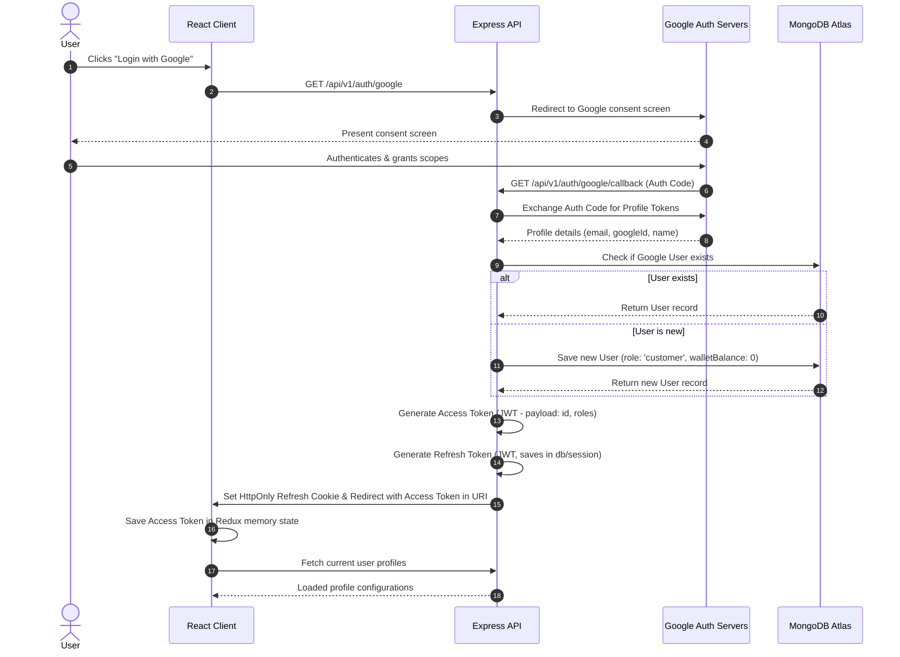
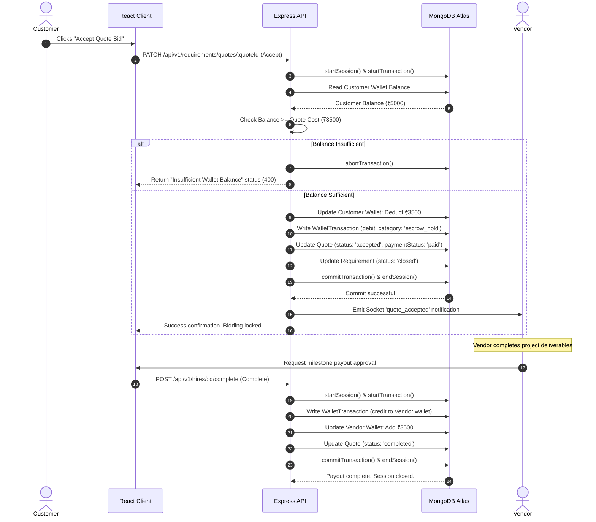
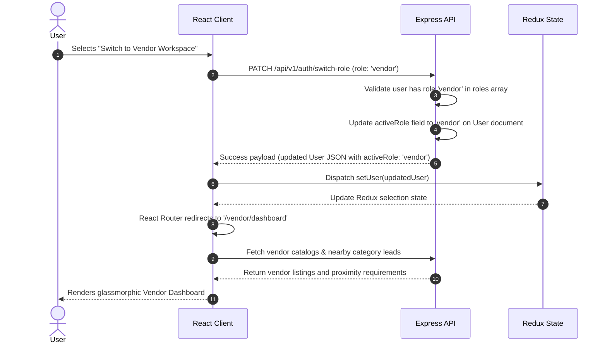

# Architecture Sequence Diagrams Spec
## BizReels Marketplace Platform

---

## 1. Google OAuth & Sign-in Lifecycle

This sequence details the user login lifecycle using Google OAuth and JWT access/refresh token exchanges.

---

## 2. Double-Entry Escrow & Payout Sequence

This sequence details the database session transaction wrapping wallet allocations upon quote acceptance.

---

## 3. Role-Switching Dashboard Lifecycle

This sequence details how a user switches their active UI workspace role and triggers dashboard reload configurations.

