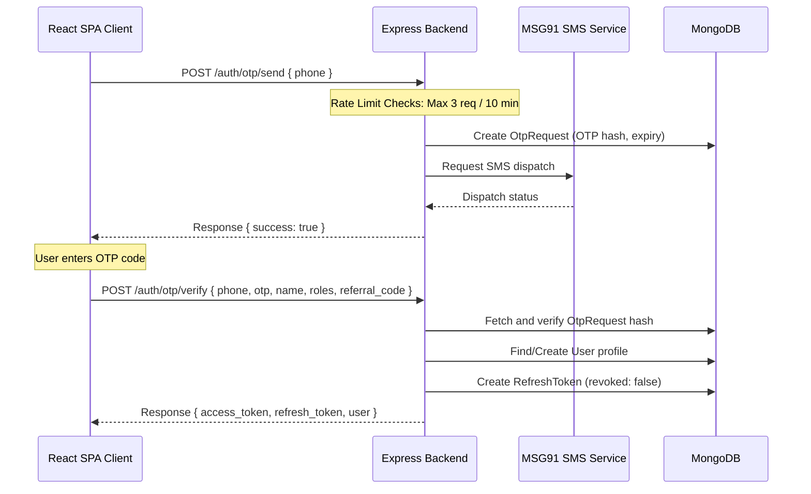

# Authentication & Security

BizReels implements a mobile-first, secure OTP-based authentication system alongside Google OAuth and development bypass options.

---

## 1. OTP Authentication Flow

### Rate Limiting Controls
1. **OTP Requests**: Standard rate limits restrict OTP dispatches to **3 requests per phone number every 10 minutes** to mitigate SMS cost exploits.
2. **OTP Verification**: Limits client attempts to **10 verification attempts per phone + IP address combination every hour** to prevent brute-force attacks.

---

## 2. JWT Lifecycles & Rotation

All authenticated client API calls must supply the header: `Authorization: Bearer <access_token>`.

### Token Expiration Parameters
* **Access Token**: Short-lived JWT (15-minute expiry). Stored in React application memory.
* **Refresh Token**: Long-lived JWT (30-day expiry). Stored in client `localStorage` under key `bizreels_refresh_token` and saved in the database `refresh_tokens` collection with a MongoDB TTL auto-delete index.

### Token Rotation Interceptor (401 Handler)
The frontend implements a single-flight refresh lock within `frontend/src/lib/api.js`:
1. If an API request fails with an HTTP `401 Unauthorized` status, the request interceptor catches it.
2. If a client `refresh_token` is present, it pauses subsequent failing requests and initiates a single `POST /auth/refresh` token request.
3. The server generates a new access token and rotating refresh token, revoking the previous one.
4. The client updates `localStorage`, releases the single-flight queue, updates header signatures, and retries the original failed requests.
5. If the refresh request itself fails (e.g. refresh token expired or revoked), all local storage credentials are wiped, and the browser redirects the user to `/login`.

---

## 3. Google OAuth Login

* **Integration**: Exchanges identity sessions at `/api/v1/auth/google/session-exchange`.
* **Behavior**: Links Google email profiles with existing phone numbers, or creates new User records with customer roles.

---

## 4. Development Bypass Modes

* **Dev OTP Banner**: When the environment configuration variable `MSG91_DEV_MODE` is set to `true`, OTP codes are mock-generated without connecting to the MSG91 SMS APIs. The React client mounts `DevOtpBanner.jsx` showing the generated OTP code directly on screen for testing.
* **Dev Admin Login Route**: If the environment configuration variable `ALLOW_DEV_ADMIN_LOGIN` is set to `true`, developers can execute bypass requests targeting `/api/v1/auth/dev/admin-login` by passing a token matching `DEV_ADMIN_OVERRIDE_TOKEN` inside the payload. This logs in the designated system administrative account (`9999999999`).
