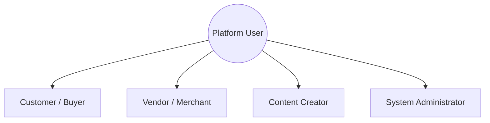

# Business Requirement Document (BRD)
## BizReels Marketplace Platform

---

## 1. Document Control & Overview

| Project Name | BizReels Platform |
|---|---|
| Document Version | 1.0.0 |
| Date | July 17, 2026 |
| Target Audience | Stakeholders, Project Managers, Developers |

### 1.1 Executive Summary
BizReels is a geolocated, short-video-driven MERN marketplace connecting **Customers**, **Vendors**, and **Content Creators**. By combining interactive social features (Reels, Live Streaming, Chats) with local commerce tools (Proximity Search, Custom Requirements Bidding, and a Double-Entry Escrow Wallet), BizReels empowers users to transact locally with verified merchants and creators.

---

## 2. Business Objectives & Vision

- **Proximity-Based Commerce**: Bridge the gap between local retail needs and local supply using geospatial calculations.
- **Creator-Driven Engagement**: Allow creators to showcase skillsets through short reels, and allow vendors to hire them to produce marketing assets.
- **Transaction Security**: Safeguard customer and creator funds via a centralized platform escrow system to eliminate payment default risks.
- **Monetization Engine**: Establish recurring revenue via subscription plans (Premium, Business, Creator) that distribute "boost credits" for content/listing visibility.

---

## 3. Stakeholders & Platform Actors

### 3.1 Customer (Buyer)
- **Objective**: Discover local products/services, view engaging video reviews (reels), request custom bids, and pay securely.
- **Key Needs**: Search proximity listings, post requirement briefs, negotiate, real-time updates, secure wallet transactions.

### 3.2 Vendor (Merchant)
- **Objective**: Advertise catalog listings, browse local requirements matching their category, submit quotes, upload reels, and hire creators.
- **Key Needs**: Storefront profile, location geo-tagging, AI description copywriting, lead bidding console, creator portfolio discovery, campaign hiring workspace.

### 3.3 Creator (Influencer / Videographer)
- **Objective**: Showcase creative talent, offer content creation packages, accept hiring contracts from vendors, stream live, and earn.
- **Key Needs**: Pricing package configurations, reel portfolio builder, campaign contract workflow, automated escrow payout.

### 3.4 Platform Administrator
- **Objective**: Maintain platform compliance, moderate content, audit transactions, and verify vendor authenticity.
- **Key Needs**: System monitoring, user document verification portal, soft delete content triggers, transaction ledger access.

---

## 4. Key Business Processes

### 4.1 Geolocated Lead Generation & Quoting
1. Customer posts a Requirement Brief detailing title, description, category, target budget, deadline, and location address (lng/lat).
2. The platform indexes coordinates (`2dsphere`) and distributes the lead to nearby Vendors registered in the matching category.
3. Vendors review and submit a single, binding Quote Proposal containing their proposed price, delivery timeline, and cover note.
4. Customer reviews bids, selects a quote, and performs wallet-based escrow allocation.

### 4.2 Content Collaboration Workflow (Hiring)
1. Vendors discover Content Creators via their portfolios and pricing packages.
2. Vendor sends a campaign proposal (`HireRequest`) indicating campaign description, budget, and delivery timeframe in days.
3. Creator accepts/rejects proposal. Upon acceptance, the vendor's wallet balance matching the budget is debited and locked in escrow.
4. Creator uploads a draft or sample reel. Upon review and contract completion, funds are released from escrow to the creator's wallet.

### 4.3 Social Commerce & Reels
1. Vendors/Creators upload short video files (Reels) geolocated to their store/studio address.
2. Users watch a geolocated feed. Social actions (likes, comments) drive community engagement.
3. Boosted reels (via subscription boost credits) receive premium placement in feeds and listings search results.

---

## 5. Core Business Rules & Financial Integrity

> [!IMPORTANT]
> **Rule 1: Centralized Double-Entry Escrow Lock**
> No transaction between users (Customer-to-Vendor, or Vendor-to-Creator) may take place directly. Funds must be debited from the sender's wallet immediately upon quote/hire acceptance and held in escrow, recorded in matching ledger rows.

> [!WARNING]
> **Rule 2: Soft Deletion Enforcement**
> To preserve financial audit trails and historical customer listings, the database must never hard-delete user accounts, listings, reels, or requirements. An `isDeleted: true` soft-delete system flag is used.

> [!NOTE]
> **Rule 3: One-Lead-One-Quote**
> A vendor can only submit exactly one quotation bid per requirement post to avoid lead spamming. The platform enforces this via a unique compound index (`requirement` + `vendor`).

---

## 6. MVP vs. Future Scope

| Feature Area | MVP Scope (Phase 1) | Future Scope (Phase 2+) |
|---|---|---|
| **Payments** | In-app wallet recharge, double-entry ledger escrow. | UPI / Credit Card gateway integrations, automatic bank payouts. |
| **Video** | Local video uploading (Cloudinary hosting), feed scrolling, comments/likes. | Video filters, in-app trimming, soundtrack integration. |
| **Broadcast** | Live chat channels, viewer tallies, and text scrolling tickers. | WebRTC peer broadcast feeds, live auctioning/shopping streams. |
| **AI Tools** | Description copy synthesis. | AI video highlight tagging, automated catalog upload parsing. |

---

## 7. Assumptions & Dependencies

- **Mobile Proximity**: It is assumed users will grant browser geolocation permissions (`navigator.geolocation`). Fallbacks will default search results to city-center coordinates.
- **Media Hosting Costs**: Platform relies on Cloudinary's free tier for images/videos. Increased user volume will require migrating to premium storage buckets.
- **Redis Dependability**: Background tasks (boost expirations, notify schedules) depend on active Redis clusters running BullMQ.
