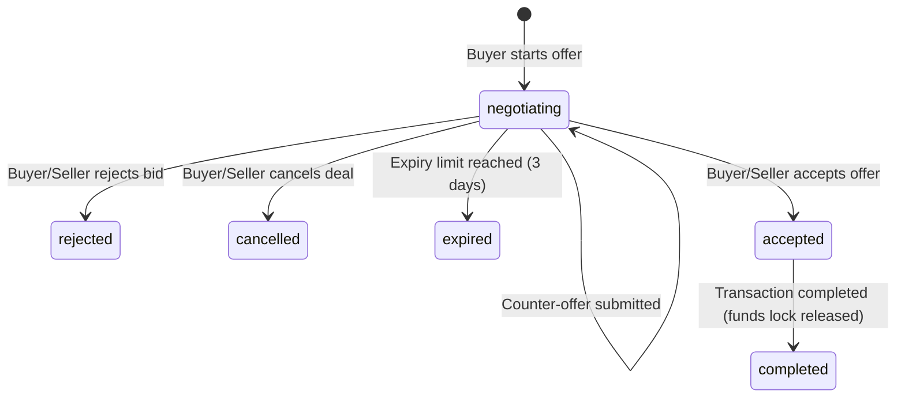

# Business Logic & Rules

BizReels incorporates strict rules governing contact reveals, KYC trust incentives, deal negotiations, and transaction ledgers.

---

## 1. Contact Reveal Rules (Scraper Protection)

To prevent automated phone scraping, user phone numbers are masked by default. Revealing a contact number is governed by `contact-reveal.service.js` under the following rules:

1. **Daily Limits**: Users are restricted to **5 free contact reveals per day**.
2. **Exemptions (Free Reveals)**: The reveal check returns `free: true` and bypasses limits if:
   * There is an active Chat Thread between the caller and the target user.
   * There is an active Deal negotiation between the caller and the target user.
   * The caller has an active Pro subscription (`is_subscribed_verified: true`).
3. **Credit Deductions**: If the daily limit is exhausted and no exemptions apply, the user can unlock the contact number by spending **5 wallet credits**. The system executes an atomic transaction, deducting credits and writing a wallet log entry.

---

## 2. KYC Trust+ signup Reward (Atomic Execution)

KYC approvals award a trust verification badge and issue a one-time signup bonus. To prevent concurrency race conditions (e.g. duplicate API calls releasing multiple bonuses), the KYC release logic implements an atomic database guard in `trust-plus.service.js`:

```javascript
// Atomic validation using Mongoose findOneAndUpdate with condition-checks
const rewardApplied = await User.findOneAndUpdate(
  {
    _id: userId,
    has_received_profile_complete_bonus: { $ne: true } // Confirm flag is false
  },
  {
    $set: { has_received_profile_complete_bonus: true }, // Mark flag immediately
    $inc: { trust_score: 15 } // Boost trust score
  },
  { new: true }
);

if (rewardApplied) {
  // Deposit KYC bonus credits into User's wallet
  await walletService.creditUser(userId, 50, "KYC Profile Completion Bonus");
}
```

This prevents duplicate payouts since subsequent parallel threads fail the conditional filter `{ has_received_profile_complete_bonus: { $ne: true } }`.

---

## 3. Deal Negotiation Lifecycle

Deals manage price negotiations inside chat threads. The deal lifecycle transitions through these states:



### Business Rules for Deals
* **Offers History**: Every counter-offer amount, sender ID, and timestamp is appended to `offers_history`.
* **Locking**: When a deal status is `accepted`, listings are temporarily locked to prevent duplicate purchases.
* **Completion Gate**: Transition to `completed` requires validation from both parties, initiating wallet debit-credit transfers and updating rating values.

---

## 4. Wallet & Credit Transactions

The platform maintains two transaction ledgers:
1. **Wallet Balance (INR Paise)**: Real cash top-ups using Razorpay. Used for subscription payments and credit bundle purchases.
2. **Credits Balance**: Digital points used to purchase listings boosts and reveal contact details.
   * *KYC Approval Bonus*: +50 credits.
   * *Referral Code Signups*: +20 credits to referrer, +10 to referred.
   * *Contact Reveal Cost*: -5 credits.
   * *Listing Boost Cost*: -10 credits/day.
