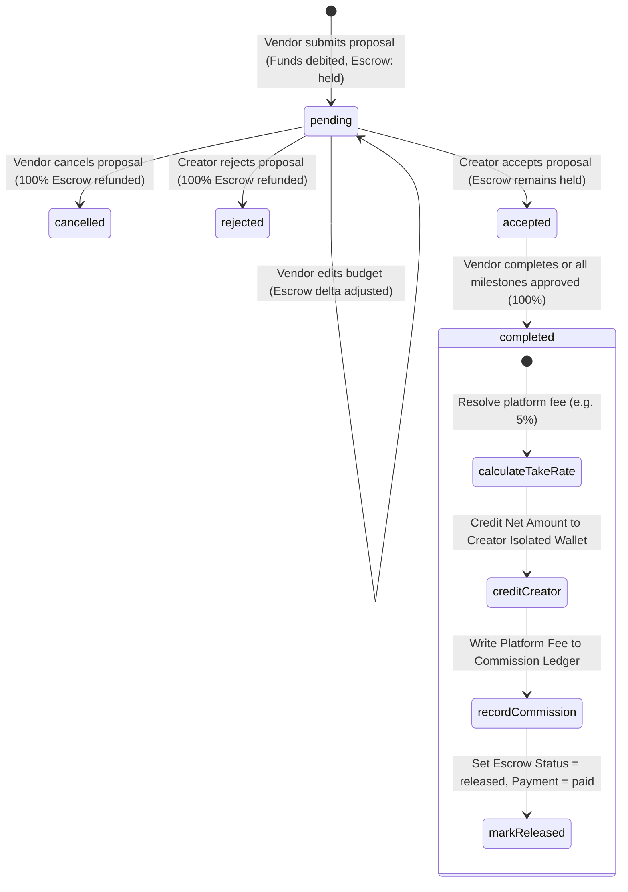

# Creator Revenue, Escrow Holding, & Financial Ledger Architecture

## Overview

The BizReels Creator Revenue and Escrow system is an enterprise-grade financial settlement engine governing brand collaboration offers, escrow balance locking, commission fee calculations, role-isolated ledger transactions, and real-time creator analytics.

---

## 1. Architectural Problem & Solution

### Prior Deficiencies
1. **Virtual/Fake Escrow Hold**: Previously, when a vendor created a campaign proposal, the system merely verified that `vendor.walletBalance >= budget` without debiting or locking the funds. The vendor could withdraw or spend that balance while the creator produced content.
2. **Missing Platform Monetization**: 100% of the budget was transferred to the creator upon completion, generating zero platform revenue and leaving no commission audit trail.
3. **Fragile Substring Ledger Routing**: The ledger relied on description string matching (`desc.includes('campaign')` or `desc.includes('creator')`) to classify transactions, risking ledger corruption.
4. **Discrepant Analytics**: Creator overview endpoints previously read the monolithic `user.walletBalance` (mixing customer refunds, vendor sales, and top-ups) instead of reading the isolated creator ledger.

### Production Solution
* **Immediate True Escrow Debit**: Vendor funds are debited immediately upon proposal submission and marked `escrowStatus: 'held'`, eliminating vendor default risk.
* **Automated Refund & Adjustment**: If a proposal is cancelled or rejected, funds are refunded automatically. If the budget is edited while pending, the delta is debited or refunded.
* **Platform Monetization Split**: An automated take-rate (default 5%, configurable via `CommissionConfig`) is deducted on completion, crediting the creator with the net take-home pay and recording the fee in the `Commission` ledger.
* **Role-Targeted Ledger Isolation**: `walletRepository.updateWalletBalance` accepts explicit `options.targetRole` (`'creator'`, `'vendor'`, `'customer'`).
* **Real-time Creator Dashboard Visibility**: Transparent gross budget, platform fee deduction, take-home earnings, and `Escrow Secured` status indicators on all campaigns.

---

## 2. State Machine & Escrow Lifecycle



---

## 3. Data Models & Schema Updates

### A. HireRequest Model (`backend/src/models/HireRequest.js`)
Tracks the contract proposal between Vendor and Creator:

```javascript
{
  vendor: { type: Schema.Types.ObjectId, ref: 'User', required: true, index: true },
  creator: { type: Schema.Types.ObjectId, ref: 'User', required: true, index: true },
  title: { type: String, required: true, maxlength: 120 },
  description: { type: String, required: true, maxlength: 1500 },
  budget: { type: Number, required: true, min: 1 },
  deliveryDays: { type: Number, required: true, min: 1 },
  status: {
    type: String,
    enum: ['pending', 'accepted', 'rejected', 'completed', 'cancelled'],
    default: 'pending',
    index: true,
  },
  paymentStatus: {
    type: String,
    enum: ['unpaid', 'paid'],
    default: 'unpaid',
  },
  escrowStatus: {
    type: String,
    enum: ['not_held', 'held', 'released', 'refunded'],
    default: 'not_held',
    index: true,
  },
  platformFeeRate: { type: Number, default: 0.05 },
  platformFee: { type: Number, default: 0 },
  netCreatorAmount: { type: Number, default: 0 },
}
```

### B. Campaign Model (`backend/src/models/Campaign.js`)
Tracks deliverables, milestones, submission links, progress, and reviews:

```javascript
{
  vendor: { type: Schema.Types.ObjectId, ref: 'User', required: true, index: true },
  creator: { type: Schema.Types.ObjectId, ref: 'User', required: true, index: true },
  hireRequest: { type: Schema.Types.ObjectId, ref: 'HireRequest', required: true, index: true },
  title: { type: String, required: true },
  description: { type: String, required: true },
  deliverables: [Schema.Types.Mixed],
  numReels: { type: Number, default: 0 },
  numPosts: { type: Number, default: 0 },
  budget: { type: Number, required: true },
  status: {
    type: String,
    enum: ['pending', 'accepted', 'rejected', 'negotiation', 'completed', 'cancelled'],
    default: 'pending',
    index: true,
  },
  progress: { type: Number, default: 0, min: 0, max: 100 },
  escrowStatus: {
    type: String,
    enum: ['not_held', 'held', 'released', 'refunded'],
    default: 'not_held',
    index: true,
  },
  platformFeeRate: { type: Number, default: 0.05 },
  platformFee: { type: Number, default: 0 },
  netCreatorAmount: { type: Number, default: 0 },
}
```

---

## 4. Financial Routing & Services

### A. Hire Service (`backend/src/services/hireService.js`)
* **`createRequest(data, req)`**:
  1. Validates vendor wallet balance: `vendor.walletBalance >= budget`.
  2. Resolves commission rate via `commissionService.resolveRate(category)` (default: `0.05`).
  3. Calculates `platformFee = Math.round(budget * rate)` and `netCreatorAmount = budget - platformFee`.
  4. Debits vendor wallet immediately: `walletRepository.updateWalletBalance(vendorId, -budget, 'payment', ..., { targetRole: 'vendor' })`.
  5. Saves both `HireRequest` and `Campaign` with `escrowStatus: 'held'`.
* **`editRequest(id, data, userId)`**:
  - If budget changes:
    - Delta > 0: Validates additional balance and debits vendor wallet.
    - Delta < 0: Refunds excess funds to vendor wallet.
    - Updates `platformFee` and `netCreatorAmount`.
* **`cancelRequest(id, userId)` & `updateRequestStatus('rejected')`**:
  - Invokes `_refundEscrow(campaign, request, reason)`: credits vendor wallet with `type: 'refund'` and sets `escrowStatus: 'refunded'`.
* **`updateRequestStatus('completed')` & `approveMilestone`**:
  - When vendor completes the campaign or all deliverables reach 100% approval:
    - Invokes `_releaseEscrowPayout(campaign, request)`:
      - Credits creator isolated wallet with `netCreatorAmount` (`targetRole: 'creator'`).
      - Accrues platform take-rate in `Commission` model.
      - Sets `escrowStatus: 'released'`, `paymentStatus: 'paid'`, `status: 'completed'`.

### B. Wallet Repository (`backend/src/repositories/walletRepository.js`)
* **Signature**:
  `updateWalletBalance(userId, amount, type, referenceId, description, externalSession = null, options = {})`
* Normalizes options if passed as 6th or 7th argument.
* If `options.targetRole` is provided, transactions and isolated wallet balances are updated directly under that specific role (`'creator'`, `'vendor'`, or `'customer'`).
* Dual-syncs both legacy `User.walletBalance` and `IsolatedWallet` / `IsolatedTransaction` records inside MongoDB transactions.
* Automatically synchronizes `Wallet.credits` for legacy user accounts.

---

## 5. Creator Analytics & Dashboard API

### Endpoints
* `GET /api/v1/creators/dashboard/stats`:
  - `totalEarnings`: Net lifetime earnings credited to the Creator Isolated Wallet.
  - `netEarnings`: Synced with `totalEarnings`.
  - `grossEarnings`: Sum of all completed campaign budgets.
  - `escrowInReview`: Sum of net secured budgets for active (`accepted`) campaigns currently in progress.
  - `pendingEscrow`: Sum of net budgets for pending campaign invitations.
  - `monthlyEarnings` & `lastMonthEarnings`: Filtered on `IsolatedTransaction` with `role: 'creator'`.
* `GET /api/v1/analytics/creator/overview`:
  - Replaced monolithic `req.user.walletBalance` with `IsolatedWallet` query for role `'creator'` to eliminate cross-role data leaks.

---

## 6. Frontend UI Components

### Creator Studio Dashboard (`frontend/src/pages/creator/dashboard/CreatorDashboardPage.jsx`)
* **Stat Cards**:
  - **Net Earnings**: Displays total settled funds in creator's wallet (`₹totalEarnings`).
  - **Escrow in Progress**: Displays funds currently locked in escrow for active shoot campaigns (`₹escrowInReview`).
  - **Active Shoots**: Active campaign count.
  - **Pending Invites**: Pending collaboration invitations.
* **Campaign Offer Cards**:
  - Gross Offer Price (`₹budget`).
  - Take-Home Breakdown Card: Platform Fee deduction (`-₹fee`) & Net Take-Home (`₹netCreatorAmount`).
  - Escrow Status Pill:
    - `Escrow Secured` (when `escrowStatus === 'held'`).
    - `Payout Released` (when `escrowStatus === 'released'`).
