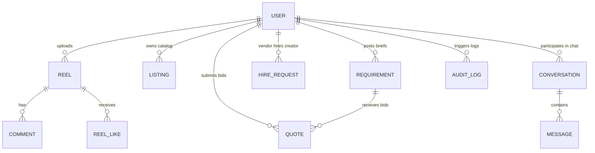

# Database Schema & Collection Relationships Design
## BizReels Marketplace Platform

---

## 1. Document Modeling Strategy (MongoDB vs SQL)

BizReels leverages a document-centric design rather than a normalized relational layout. 

```
Relational Approach (Multi-Table Joins) ──> [Users] ⏛ [Roles] ⏛ [Subscriptions] ⏛ [Wallets]
                                                                        
Document Approach (Single read fetch) ──> [User { Embedded Profiles, Subscription, Wallet }]
```

### 1.1 Embedded Profiles vs. References
- **Embedded Documents**: Profile-specific properties (`customerProfile`, `vendorProfile`, `creatorProfile`), `subscription` states, and `walletBalance` are embedded directly inside the `User` document. This optimizes read latency by retrieving user details, active dashboard states, and balances in a single query.
- **Referenced Collections**: High-volume, unbounded documents like `Reel`, `Listing`, `Requirement`, and `Message` are split into individual collections and linked via `ObjectId` references to prevent exceeding MongoDB's 16MB document size limit.

---

## 2. Entity-Relationship (ER) Diagram



---

## 3. Detailed Collection Specifications

### 3.1 `User` Collection (Primary Identity Document)
Holds system identities, multi-role configurations, embedded profiles, and wallet balances.

```json
{
  "_id": "ObjectId",
  "name": "String (required, indexed)",
  "email": "String (unique, lowercase)",
  "phone": "String (unique, sparse)",
  "password": "String (bcrypt hash, select: false)",
  "avatarUrl": "String",
  "authProvider": "String (enum: ['local', 'google', 'otp'])",
  "roles": ["String (enum: ['customer', 'vendor', 'creator', 'admin'])"],
  "activeRole": "String (enum: ['customer', 'vendor', 'creator', 'admin'])",
  "walletBalance": "Number (default: 0, min: 0)",
  "subscription": {
    "plan": "String (enum: ['free', 'premium', 'business', 'creator'])",
    "startedAt": "Date",
    "expiresAt": "Date",
    "boostCredits": "Number"
  },
  "customerProfile": {
    "interests": ["String"],
    "savedListings": ["ObjectId -> Listing"]
  },
  "vendorProfile": {
    "businessName": "String",
    "description": "String",
    "category": "String (indexed)",
    "location": {
      "type": "String (default: 'Point')",
      "coordinates": ["Number (lng, lat)"],
      "address": "String"
    },
    "rating": "Number",
    "totalReviews": "Number"
  },
  "creatorProfile": {
    "bio": "String",
    "skills": ["String"],
    "pricingTiers": [{
      "label": "String",
      "price": "Number",
      "deliverables": "String"
    }],
    "rating": "Number"
  },
  "isDeleted": "Boolean (default: false, indexed)"
}
```

### 3.2 `Listing` Collection (Catalog Products/Services)
Acts as the central catalog holding items offered by vendors.

```json
{
  "_id": "ObjectId",
  "vendor": "ObjectId -> User (indexed)",
  "type": "String (enum: ['product', 'service'], indexed)",
  "title": "String (required, indexed)",
  "description": "String",
  "category": "String (indexed)",
  "price": "Number",
  "condition": "String (enum: ['new', 'refurbished', 'used', 'not_applicable'])",
  "location": {
    "type": "String (default: 'Point')",
    "coordinates": ["Number (lng, lat)"]
  },
  "isBoosted": "Boolean (default: false, indexed)",
  "isDeleted": "Boolean (default: false, indexed)"
}
```

### 3.3 `Requirement` Collection (Customer Project Briefs)
Represents customer custom requirements posted for bidding.

```json
{
  "_id": "ObjectId",
  "customer": "ObjectId -> User (indexed)",
  "title": "String (required)",
  "description": "String",
  "category": "String (indexed)",
  "budget": "Number",
  "deadline": "Date (indexed)",
  "location": {
    "type": "String (default: 'Point')",
    "coordinates": ["Number (lng, lat)"]
  },
  "status": "String (enum: ['open', 'closed', 'completed'], indexed)",
  "isDeleted": "Boolean (default: false, indexed)"
}
```

### 3.4 `Quote` Collection (Vendor Proposals)
Tracks quotes/bids submitted by vendors responding to customer requirements.

```json
{
  "_id": "ObjectId",
  "requirement": "ObjectId -> Requirement (indexed)",
  "vendor": "ObjectId -> User (indexed)",
  "price": "Number",
  "notes": "String",
  "estimatedDelivery": "Date",
  "status": "String (enum: ['pending', 'accepted', 'rejected'], indexed)",
  "paymentStatus": "String (enum: ['unpaid', 'paid'])",
  "isDeleted": "Boolean (default: false, indexed)"
}
```
*Note: Includes a compound unique constraint on `{ requirement: 1, vendor: 1 }` to enforce single-proposal rules.*

### 3.5 `HireRequest` Collection (Vendor-Creator Campaigns)
Handles marketing contracts where vendors commission creator deliverables.

```json
{
  "_id": "ObjectId",
  "vendor": "ObjectId -> User (indexed)",
  "creator": "ObjectId -> User (indexed)",
  "title": "String",
  "description": "String",
  "budget": "Number",
  "deliveryDays": "Number",
  "status": "String (enum: ['pending', 'accepted', 'rejected', 'completed'], indexed)",
  "paymentStatus": "String (enum: ['unpaid', 'paid'])"
}
```

### 3.6 `Reel` & `ReelLike` Collection (Social Interface)
- **`Reel`**: Contains Cloudinary URLs, captions, metrics, and boost credits flags.
- **`ReelLike`**: Tracks user interaction links avoiding unbounded likes arrays on Reel documents.

---

## 4. Collection Relationships Mapping

| Source Collection | Target Collection | Relationship Type | Cardinality | Implementation Pattern |
|---|---|---|---|---|
| `User` | `Reel` | Reference | 1 : N | Ref link stored on Reel (`creator`) |
| `User` | `Listing` | Reference | 1 : N | Ref link stored on Listing (`vendor`) |
| `User` | `User` (Followers) | Embedded Array | N : M | Array of `ObjectId` refs inside `followers` field |
| `Requirement` | `Quote` | Reference | 1 : N | Ref link stored on Quote (`requirement`) |
| `Conversation` | `Message` | Reference | 1 : N | Ref link stored on Message (`conversation`) |
| `User` | `AuditLog` | Reference | 1 : N | Ref link stored on AuditLog (`userId`) |
