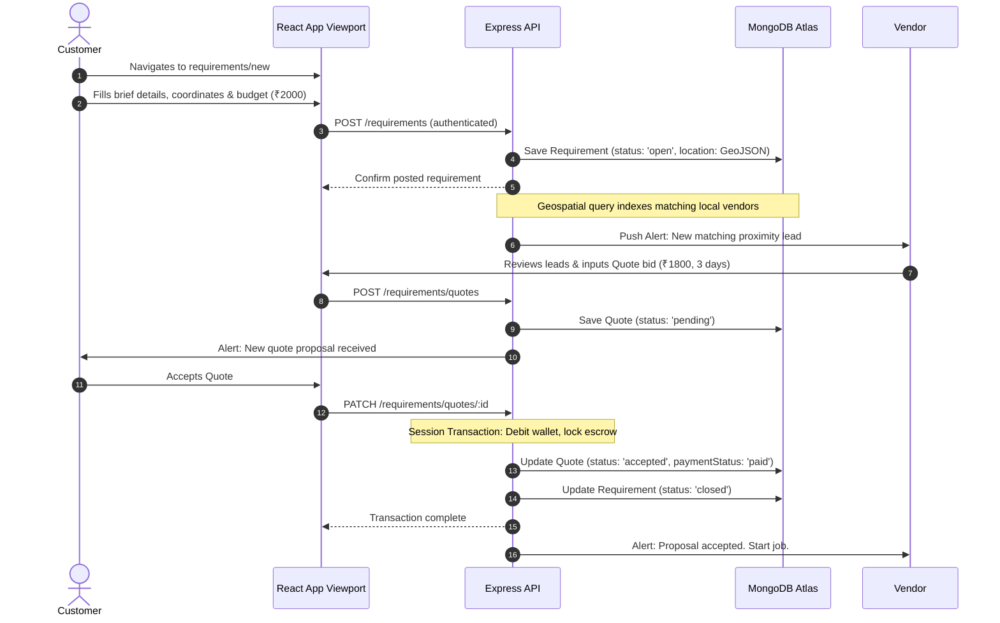
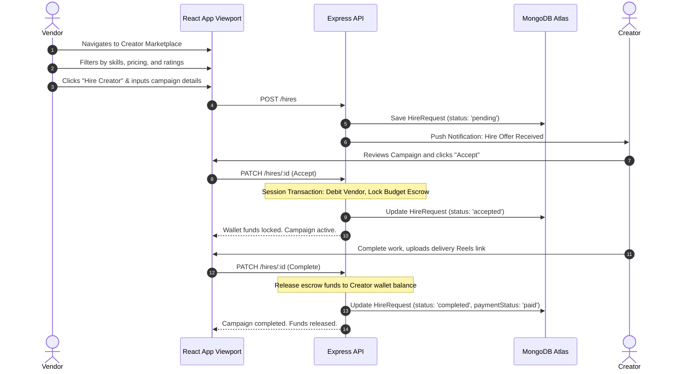
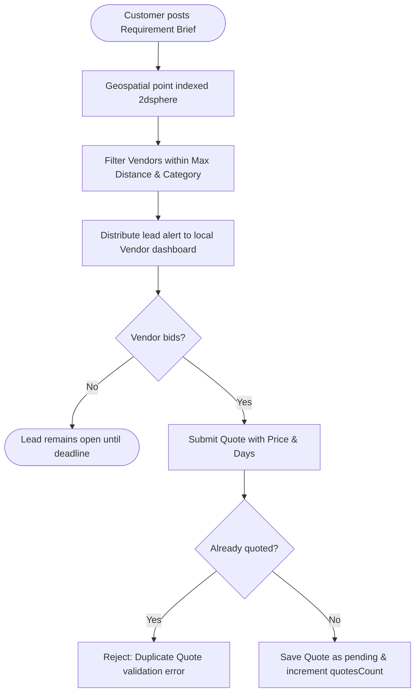
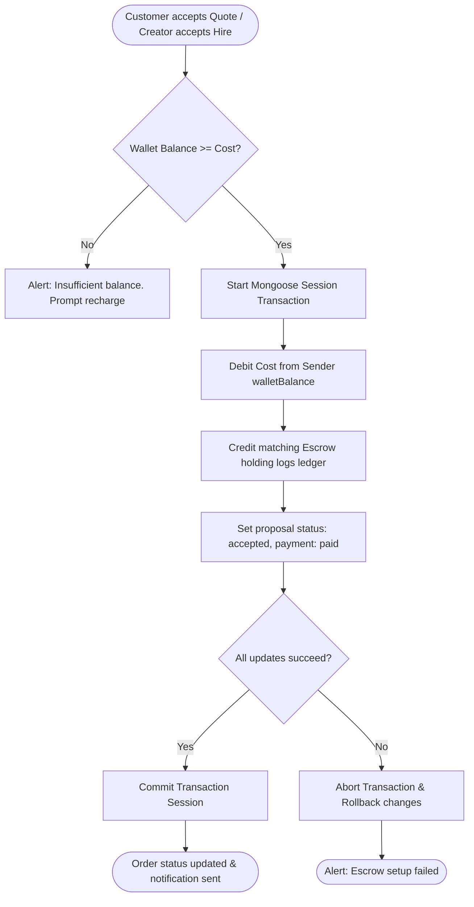

# User Flow & Journeys Document
## BizReels Marketplace Platform

---

## 1. User Journeys

### 1.1 Customer Journey: Local Custom Request Fulfillment

### 1.2 Vendor Journey: Creator Collaboration Campaign

---

## 2. Core User Flows

### 2.1 Lead Matching & Quoting Flowchart

### 2.2 Wallet Escrow Session Transaction Flowchart

