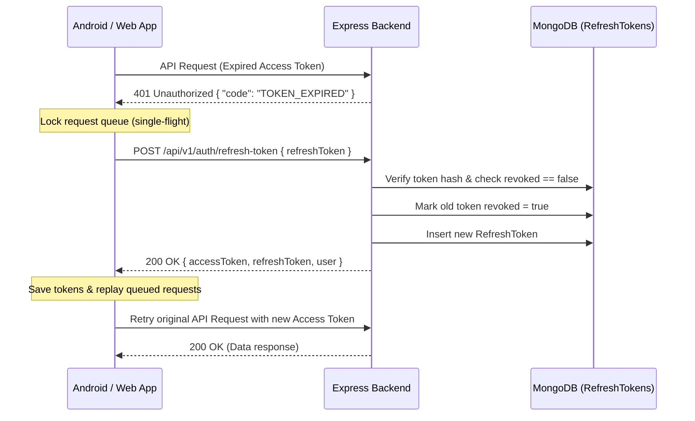

# Authentication, Identity, & Session Management

> **Platform Version:** 1.4.0  
> **Source Code Implementation:** `backend/src/routes/authRoutes.js`, `backend/src/controllers/authController.js`, `backend/src/services/authService.js`  
> **Middlewares:** `backend/src/middleware/auth.js` (`authenticate`), `backend/src/middleware/auth.middleware.js` (`requireAuth`)  

---

## 1. Authentication Architecture Overview

BizReels implements a hybrid, mobile-first authentication system designed to serve both React Single-Page Web Applications and Android native mobile clients:

1. **Dual-Channel OTP Login & Registration:** Passwordless authentication via SMS and WhatsApp using MSG91.
2. **Native Google OAuth & ID Token Exchange:** Supports browser redirects for Web and direct ID Token exchange for Android Google Sign-In SDK.
3. **Email + Password Authentication:** Traditional email registration and login with bcrypt hashing.
4. **JWT Session Lifecycle:** Dual-token architecture using short-lived Access Tokens and rotating Refresh Tokens with MongoDB TTL tracking.
5. **Multi-Role Profile Switching:** Ability for a single authenticated account to switch active workspaces (Customer, Vendor, Creator) without re-logging in.
6. **Development Bypass Options:** Zero-cost dev login and OTP simulation for rapid testing.

---

## 2. JWT Lifecycles & Security Tokens

### 2.1 Token Types & Lifespans
| Token Type | Lifespan | Storage (Web) | Storage (Android) | Transmitted Via |
|---|---|---|---|---|
| **Access Token** | **15 minutes** | In-Memory (Zustand store) | EncryptedSharedPreferences / DataStore | `Authorization: Bearer <token>` |
| **Refresh Token** | **30 days** | `httpOnly` Secure Cookie (`refreshToken`) | EncryptedSharedPreferences | Request Body / Cookie |

### 2.2 Token Signature & Validation
The backend verifies incoming JWT tokens using `process.env.JWT_ACCESS_SECRET` (fallback to `process.env.JWT_SECRET`).
Payload embedded in JWT:
```json
{
  "id": "65e9b8f2d84712001a1c94b2",
  "role": "customer",
  "iat": 1726074900,
  "exp": 1726075800
}
```

### 2.3 Single-Flight Token Refresh Workflow
When any authenticated API request fails with `401 Unauthorized`, client interceptors execute an atomic token rotation:



---

## 3. Dual-Channel OTP Flow (SMS & WhatsApp)

### 3.1 Primary Request: Dispatch OTP
* **Endpoint:** `POST /api/v1/auth/otp/send` (Rate limited: Max 3 requests / 10 min)
* **Headers:** `Content-Type: application/json`
* **Request Body:**
  ```json
  {
    "phone": "9876543210",
    "channel": "sms"
  }
  ```
* **Payload Fields:**
  | Field | Type | Required | Allowed Values | Description |
  |---|---|---|---|---|
  | `phone` | String | **Yes** | 10 digits (e.g. `"9876543210"`) | Indian 10-digit mobile number. Prefix `+91` will be sanitized by server. |
  | `channel` | String | No | `"sms"`, `"whatsapp"` | Delivery channel. Defaults to `"sms"`. |

* **Success Response (200 OK):**
  ```json
  {
    "success": true,
    "message": "OTP sent successfully to +919876543210 via SMS",
    "data": {
      "phone": "+919876543210",
      "channel": "sms",
      "expiresInSeconds": 600
    }
  }
  ```

### 3.2 Primary Request: Verify OTP & Login
* **Endpoint:** `POST /api/v1/auth/otp/verify` (Rate limited: Max 10 attempts / hour)
* **Request Body:**
  ```json
  {
    "phone": "9876543210",
    "otp": "452189",
    "name": "Arjun Sharma",
    "roles": ["customer"],
    "referral_code": "BIZREF88"
  }
  ```
* **Payload Fields:**
  | Field | Type | Required | Description |
  |---|---|---|---|
  | `phone` | String | **Yes** | 10-digit phone number matching dispatch request. |
  | `otp` | String | **Yes** | 4-to-6 digit numeric OTP code. |
  | `name` | String | No | Full name (used when auto-creating new accounts). |
  | `roles` | Array[String] | No | Desired initial roles: `["customer"]`, `["vendor"]`, `["creator"]`. Defaults to `["customer"]`. |
  | `referral_code` | String | No | Referral invite code of the inviter. |

* **Success Response (200 OK):**
  ```json
  {
    "success": true,
    "message": "Login successful",
    "data": {
      "accessToken": "eyJhbGciOi...",
      "refreshToken": "d8f3a9e...",
      "user": {
        "_id": "65e9b8f2d84712001a1c94b2",
        "name": "Arjun Sharma",
        "phone": "+919876543210",
        "roles": ["customer"],
        "activeRole": "customer",
        "isPhoneVerified": true,
        "wallet_balance": 0
      }
    }
  }
  ```

### 3.3 Resend OTP
* **Endpoint:** `POST /api/v1/auth/otp/resend`
* **Request Body:** `{ "phone": "9876543210", "channel": "whatsapp" }`
* **Success Response (200 OK):** `{ "success": true, "message": "OTP resent successfully" }`

### 3.4 OTP Legacy & Alias Endpoints (Backward Compatibility)
The backend registers several legacy aliases that route to the same controller logic:
- `POST /api/v1/auth/otp/request` — Legacy web alias
- `POST /api/v1/auth/phone/send-otp` — Legacy mobile alias
- `POST /api/v1/auth/send-otp` — Root auth alias
- `POST /api/v1/auth/phone/verify-otp` — Legacy mobile verify alias
- `POST /api/v1/auth/verify-otp` — Root auth verify alias

---

## 4. Google OAuth & Native Mobile Token Exchange

### 4.1 Native Mobile SDK Direct Token Exchange (Recommended for Android)
When building native Android apps using Google Play Services Identity Sign-In, the mobile app obtains an `idToken` directly from Google on the device. It sends this token to the backend without launching web redirect browsers:

* **Primary Endpoint:** `POST /api/v1/auth/google/token`
* **Aliases:** `POST /api/v1/auth/google/mobile`, `POST /api/v1/auth/app/google`
* **Headers:** `Content-Type: application/json`
* **Request Body:**
  ```json
  {
    "idToken": "eyJhbGciOiJSUzI1NiIsImtpZCI6...",
    "role": "customer",
    "referral_code": "BIZ123"
  }
  ```
* **Success Response (200 OK):** Returns standard tokens (`accessToken`, `refreshToken`, `user`).

> [!WARNING]
> **Defunct Endpoint Alert:** Older documentation and frontend code references `POST /api/v1/auth/google/session-exchange`. **This endpoint does not exist in `authRoutes.js`**. Mobile and web clients must use `POST /api/v1/auth/google/token` for direct token exchanges.

### 4.2 Web Browser OAuth Redirect Flow
* **Initiate:** `GET /api/v1/auth/google?redirect_uri=https://bizreels.in/dashboard`
* **Callback:** `GET /api/v1/auth/google/callback`

### 4.3 Mobile Browser Deep-Link OAuth Flow
* **Initiate:** `GET /api/v1/auth/app/google?redirect_uri=bizreel://auth/callback`
* **Callback:** `GET /api/v1/auth/app/google/callback` (Redirects to app scheme `bizreel://auth/callback?token=...`)

---

## 5. Email & Password Authentication

### 5.1 Register with Email
* **Endpoint:** `POST /api/v1/auth/register`
* **Request Body:**
  ```json
  {
    "name": "Pooja Verma",
    "email": "pooja@example.com",
    "password": "Password123!",
    "phone": "9876500000",
    "roles": ["customer", "vendor"]
  }
  ```
* **Success Response (201 Created):** `{ "success": true, "message": "User registered successfully", "data": { "user": { ... }, "accessToken": "..." } }`

### 5.2 Login with Email
* **Endpoint:** `POST /api/v1/auth/login`
* **Request Body:**
  ```json
  {
    "email": "pooja@example.com",
    "password": "Password123!"
  }
  ```

### 5.3 Password Recovery Flow
* **Request Password Reset OTP:** `POST /api/v1/auth/forgot-password`  
  Payload: `{ "email": "pooja@example.com" }`
* **Reset Password with OTP:** `POST /api/v1/auth/reset-password`  
  Payload: `{ "email": "pooja@example.com", "otp": "948271", "newPassword": "NewSecurePassword123!" }`

---

## 6. Role Management & Workspace Switching

### 6.1 Switch Active Role
Swaps the user's active session workspace without logging out.
* **Endpoint:** `PATCH /api/v1/auth/switch-role`
* **Headers:** `Authorization: Bearer <token>`
* **Request Body:**
  ```json
  {
    "role": "vendor"
  }
  ```
* **Validation:** Role must be present in the user's `roles` array (e.g., `["customer", "vendor"]`).
* **Success Response (200 OK):**
  ```json
  {
    "success": true,
    "message": "Role switched to vendor successfully",
    "data": {
      "activeRole": "vendor",
      "user": { ... }
    }
  }
  ```

### 6.2 Add Role to Existing Account
Enables a customer to upgrade to become a vendor or creator.
* **Endpoint:** `POST /api/v1/auth/add-role`
* **Headers:** `Authorization: Bearer <token>`
* **Request Body:**
  ```json
  {
    "role": "vendor"
  }
  ```

---

## 7. Profile & Session Termination

| Method | Endpoint | Auth | Purpose |
|---|---|---|---|
| `GET` | `/api/v1/auth/me` | Bearer Token | Retrieve currently logged-in user profile, roles, and status. |
| `PATCH` | `/api/v1/auth/profile` | Bearer Token | Update name, avatar, bio, or social links. |
| `POST` | `/api/v1/auth/logout` | Bearer Token | Revoke current device refresh token and clear session cookies. |
| `POST` | `/api/v1/auth/logout-all` | Bearer Token | Revoke all refresh tokens across all mobile/web sessions. |
| `DELETE` | `/api/v1/auth/profile` | Bearer Token | Soft-deletes user profile (`isDeleted: true`). Aliases: `/auth/me`, `/auth/delete-account`. |

---

## 8. Development Bypass Modes

### 8.1 Instant Admin Override Login (No SMS Required)
To allow testing admin dashboards without burning MSG91 credits:
* **Endpoint:** `POST /api/v1/auth/dev/admin-login`
* **Requirement:** Backend environment variable `ALLOW_DEV_ADMIN_LOGIN=true`.
* **Request Body:**
  ```json
  {
    "token": "DEV_ADMIN_SECRET_TOKEN"
  }
  ```
* **Result:** Returns administrative user session for phone `9999999999`.

### 8.2 MSG91 Mock Mode
When `MSG91_DEV_MODE=true` in `backend/.env`:
* OTP is generated on the server but **not dispatched over SMS**.
* Fixed/logged OTP code `123456` is accepted in development mode.
