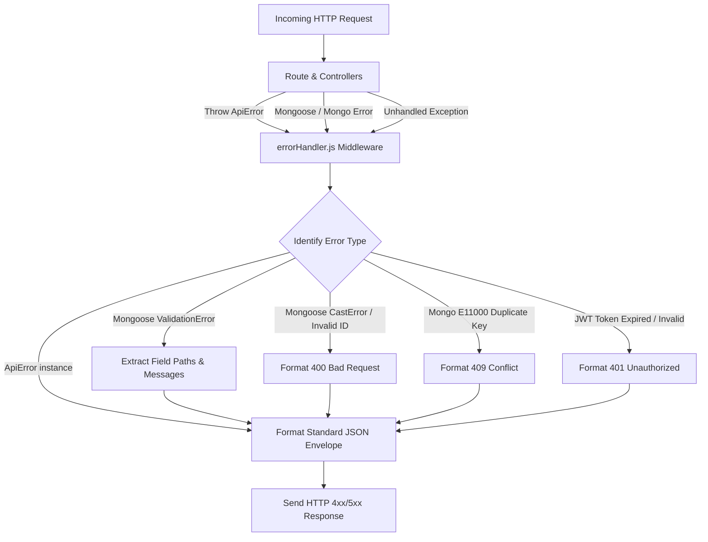

# Standard Error Handling & Fault Protocol

> **Platform Version:** 1.4.0  
> **Source Code Implementation:** `backend/src/utils/ApiError.js`, `backend/src/middleware/errorHandler.js`  
> **Target Audience:** Frontend Engineers (React), Mobile Engineers (Android / iOS), API Integrators  

---

## 1. Overview & Architectural Policy

All API endpoints in BizReels follow a unified, deterministic error structure. Regardless of whether an error originates from route parameter validation, business logic violations, authentication failures, database constraints, or unexpected runtime exceptions, the response will always be returned as a JSON document containing `"success": false`.



---

## 2. Standard Error Response Envelope

Every error response returned by the server strictly follows this JSON schema:

```json
{
  "success": false,
  "message": "Human readable error summary",
  "errors": [
    {
      "field": "quantity",
      "message": "Quantity must be between 1 and 99"
    }
  ],
  "code": "VALIDATION_ERROR",
  "stack": "Error: ... (Included in Development environment only)"
}
```

### Envelope Field Definitions
| Field | Type | Presence | Description |
|---|---|---|---|
| `success` | Boolean | Always `false` | Deterministic boolean flag indicating failure. |
| `message` | String | Always Present | High-level, user-friendly explanation of why the request failed. |
| `errors` | Array[Object] \| Array[String] | Conditional | Detailed field-level validation errors or validation error strings. Empty if not a validation error. |
| `code` | String | Optional / Common | Machine-readable error code string for client programmatic handling (e.g. `"TOKEN_EXPIRED"`). |
| `stack` | String | Dev Only | Full JavaScript call stack. **Strictly stripped in `NODE_ENV=production`**. |

---

## 3. HTTP Status Codes & Error Taxonomy

| HTTP Code | Category | Meaning & Cause | Client Handling Action |
|---|---|---|---|
| `400 Bad Request` | Validation / Logic | Missing parameters, illegal types, business rule violated (e.g. insufficient wallet balance). | Highlight error fields in UI or display toast. |
| `401 Unauthorized` | Authentication | Missing `Authorization` header, invalid JWT signature, expired access token. | Initiate token refresh flow; if refresh fails, redirect to `/login`. |
| `403 Forbidden` | Authorization | User authenticated, but lacks required role (e.g. customer attempting vendor action). | Display "Access Denied" view or prompt role upgrade. |
| `404 Not Found` | Missing Resource | Invalid ID, soft-deleted resource, or non-existent route. | Display 404 Empty State view. |
| `409 Conflict` | State Conflict | Resource already exists (phone/email taken), duplicate transaction ID. | Inform user of conflict (e.g. "Email already registered"). |
| `422 Unprocessable` | Business Invariant | Syntax valid, but action violates semantic workflow (e.g. cancel delivered order). | Present clear business guidance to user. |
| `429 Too Many Requests` | Rate Limiter | Exceeded rate limits (OTP dispatches: 3 / 10 min; Auth logins: 10 / min). | Show cooldown timer to user. |
| `500 Server Error` | Backend Failure | Uncaught exception, database connection loss, unhandled third-party timeout. | Display generic "Something went wrong" retry view. |

---

## 4. Error Categories & Canonical Examples

### 4.1 Field-Level Validation Errors (`400 Bad Request`)
Produced by Joi / express-validator or Mongoose validation schemas:

```json
{
  "success": false,
  "message": "Validation failed",
  "errors": [
    {
      "field": "phone",
      "message": "Phone number must be a valid 10-digit Indian mobile number"
    },
    {
      "field": "channel",
      "message": "\"channel\" must be one of [sms, whatsapp]"
    }
  ],
  "code": "VALIDATION_ERROR"
}
```

### 4.2 Authentication & Token Errors (`401 Unauthorized`)
Produced by `middleware/auth.js` or `middleware/auth.middleware.js`:

* **Case 1: Token Missing**
  ```json
  {
    "success": false,
    "message": "Authentication required. Please provide a Bearer token in the Authorization header.",
    "code": "AUTH_REQUIRED"
  }
  ```

* **Case 2: Token Expired**
  ```json
  {
    "success": false,
    "message": "Access token has expired. Please refresh your session.",
    "code": "TOKEN_EXPIRED"
  }
  ```

* **Case 3: User Revoked or Deleted**
  ```json
  {
    "success": false,
    "message": "The account associated with this session has been disabled.",
    "code": "ACCOUNT_DISABLED"
  }
  ```

### 4.3 Authorization & Role Errors (`403 Forbidden`)
Produced by `authorize(...roles)`:

```json
{
  "success": false,
  "message": "Access denied. Required role: vendor. Current active role: customer.",
  "code": "FORBIDDEN_ROLE"
}
```

### 4.4 Resource Not Found Errors (`404 Not Found`)
Produced when an ObjectId does not exist or has `isDeleted: true`:

```json
{
  "success": false,
  "message": "Listing not found or has been removed by the vendor",
  "code": "RESOURCE_NOT_FOUND"
}
```

### 4.5 Rate Limit Exceeded (`429 Too Many Requests`)
Produced by `middleware/rateLimiter.js`:

```json
{
  "success": false,
  "message": "Too many requests. You have reached the limit of 3 OTP dispatches per 10 minutes. Please try again later.",
  "code": "RATE_LIMIT_EXCEEDED"
}
```

### 4.6 MongoDB Constraint Conflicts (`409 Conflict`)
Automatically transformed from MongoDB error `E11000`:

```json
{
  "success": false,
  "message": "An account with this mobile number already exists.",
  "code": "DUPLICATE_KEY_ERROR"
}
```

---

## 5. Client Integration Recipes (Android & Web)

### 5.1 Android (Kotlin + Retrofit / OkHttp Interceptor)
```kotlin
data class ApiErrorResponse(
    val success: Boolean,
    val message: String,
    val errors: List<FieldError>?,
    val code: String?
)

data class FieldError(
    val field: String,
    val message: String
)

// OkHttp Error Parser Utility
fun parseApiError(responseBody: String?): ApiErrorResponse? {
    return try {
        Gson().fromJson(responseBody, ApiErrorResponse::class.java)
    } catch (e: Exception) {
        null
    }
}
```

### 5.2 Web (Axios Interceptor in React)
```javascript
// frontend/src/lib/api.js
api.interceptors.response.use(
  (response) => response.data,
  (error) => {
    const errorData = error.response?.data;
    const message = errorData?.message || 'A network error occurred. Please try again.';
    const errors = errorData?.errors || [];
    const code = errorData?.code || 'UNKNOWN_ERROR';
    
    return Promise.reject({
      status: error.response?.status,
      message,
      errors,
      code
    });
  }
);
```
