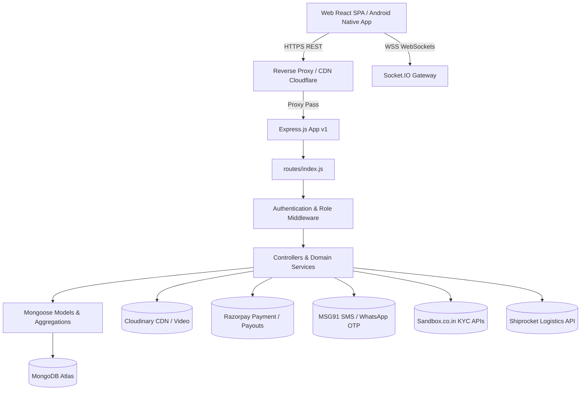

# BizReels API Overview & Architectural Standards

> **Platform Version:** 1.4.0  
> **Target Audience:** Frontend Engineers (React), Mobile Engineers (Android Kotlin / iOS Swift), Backend Integrators  
> **Last Verified Against Source Code:** September 2026  

---

## 1. Architectural Overview

BizReels is an enterprise social commerce, short-form video, multi-vendor marketplace, and creator collaboration platform. The backend is engineered using **Node.js, Express.js, MongoDB (Mongoose), and Socket.IO**.



### Module Boundaries
The backend architecture is structured around **24 distinct domain areas**:
1. **Authentication & Identity:** Dual-channel OTP (SMS + WhatsApp), Google OAuth, JWT lifecycle.
2. **Catalog & Listings:** Physical products, services, digital assets, geo-spatial proximity filters.
3. **Short-Form Video (Reels):** Adaptive transcoding, video feeds, likes, comments, shares, views.
4. **Cart & Multi-Vendor Checkout:** Direct vendor grouping, inventory verification, deals.
5. **Orders & Escrow:** Multi-state lifecycle, payment locks, delivery confirmation, return windows.
6. **Wallet & Ledger:** Double-entry ledger, recharge, transaction records, creator escrow.
7. **Creator Studio & Marketplace:** Hire creators, rate cards, proposals, portfolio showcases.
8. **Real-Time Chat:** 1-to-1 messaging, deal negotiations, order status notifications.
9. **Vendor Portal:** Storefront profile, dynamic discount offers, sales analytics.
10. **Admin Control Plane:** 127 endpoints managing moderation, verification, commissions, and payouts.
11. **KYC & Verification:** Government sandbox integrations (PAN, Aadhaar OTP, GSTIN, Bank penny-drop).
12. **Live Streaming:** Live shopping, WebRTC room negotiation, pinned products.
13. **Subscription & Add-ons:** Vendor and creator subscription tiers, custom add-ons, Razorpay orders.
14. **Referral Program:** Two-sided incentives, reward redemption, fraud detection.
15. **Customer Leads & Inquiries:** Category-matched RFQs, quote bidding.
16. **Reviews & Trust Score:** Verified purchase reviews, algorithmic vendor reliability scores.
17. **AI Services:** Gemini 1.5 Flash descriptions, hashtags, content safety audits.
18. **SEO & Dynamic Metadata:** Sitemaps, robots.txt, dynamic OpenGraph HTML renderers.

---

## 2. Base URLs & Network Topology

### Production & Staging Environments
* **Canonical Production Base URL:** `https://bizreels.in/api/v1`
* **Direct Backend (Render Web Service):** `https://bizreels-backend.onrender.com/api/v1`
* **Local Development Base URL:** `http://localhost:5000/api/v1`
* **Interactive Swagger UI:** `http://localhost:5000/api-docs` (or `/docs`)
* **Raw OpenAPI Specification JSON:** `http://localhost:5000/api-docs.json`
* **Real-Time WebSocket Server:** `wss://bizreels.in` (path: `/socket.io`)

### Path Prefix Compatibility
For backward compatibility across different client deployments, routes are registered at four root prefixes simultaneously in [`backend/src/app.js:188-191`](file:///d:/BizReels%20Website/backend/src/app.js#L188-L191):
- `/api/v1/*` — **Canonical (Recommended for all Android and Web clients)**
- `/api/*` — Legacy alias
- `/v1/*` — Mobile shorthand alias
- `/*` — Root fallback alias

> [!IMPORTANT]
> Always configure Android Retrofit / Ktor clients with the canonical base URL: `https://bizreels.in/api/v1/`.

---

## 3. Request Conventions & Common Headers

All API requests consuming or producing payloads must adhere to standard JSON and multipart specifications.

### Headers Table
| Header Name | Required | Type | Allowed Values / Example | Description |
|---|---|---|---|---|
| `Content-Type` | Yes (for POST/PUT/PATCH) | String | `application/json`<br>`multipart/form-data` | Body format. Use `multipart/form-data` when uploading files. |
| `Accept` | Yes | String | `application/json` | Explicitly request JSON responses. |
| `Authorization` | Yes (for protected routes) | String | `Bearer <access_token>` | JWT Access Token issued upon login/verification. |
| `x-client-platform` | Recommended | String | `android`, `ios`, `web` | Client telemetry and platform-specific format tailoring. |
| `x-client-version` | Recommended | String | `1.4.0` (Semantic Version) | Helps backend route backward-compatible responses. |

---

## 4. Response Envelope Specifications

The BizReels API strictly follows structured JSON envelope conventions.

### 4.1 Standard Success Envelope
All successful HTTP 200/201 responses return:
```json
{
  "success": true,
  "message": "Operation completed successfully.",
  "data": {
    "id": "64f9b8c0e2a3b4c5d6e7f8a1",
    "status": "active"
  }
}
```

### 4.2 Standard Paginated List Envelope
Endpoints returning collections utilize pagination query parameters (`page`, `limit`):
```json
{
  "success": true,
  "data": [
    { "_id": "...", "name": "..." }
  ],
  "pagination": {
    "total": 128,
    "page": 1,
    "limit": 20,
    "pages": 7,
    "hasNextPage": true,
    "hasPrevPage": false
  }
}
```
*(Note: Some legacy endpoints wrap items as `{ items: [...], total: 128, page: 1, pages: 7 }` inside the `data` object. Clients should inspect both formats).*

---

## 5. Error Envelope Specifications

When an error occurs, the server responds with an appropriate HTTP 4xx or 5xx code and a standardized error body generated by [`backend/src/middleware/errorHandler.js`](file:///d:/BizReels%20Website/backend/src/middleware/errorHandler.js):

```json
{
  "success": false,
  "message": "Validation failed on submitted payload",
  "errors": [
    {
      "field": "phone",
      "message": "Phone number must be a valid 10-digit Indian mobile number"
    }
  ],
  "code": "VALIDATION_ERROR"
}
```

### Standard HTTP Status Codes Used:
| HTTP Status | Meaning | Typical Usage Scenario |
|---|---|---|
| `200 OK` | Success | Resource retrieved, updated, or executed. |
| `201 Created` | Resource Created | New user registered, reel uploaded, order placed. |
| `400 Bad Request` | Validation Failure | Missing required fields, invalid formats, business rule violation. |
| `401 Unauthorized` | Authentication Required | Token missing, expired, or signature invalid. |
| `403 Forbidden` | Access Denied | Authenticated user lacks the required role (e.g. customer accessing admin route). |
| `404 Not Found` | Resource Missing | Item, order, or route not found. |
| `409 Conflict` | Duplicate Resource | Email/phone already registered, deal already active. |
| `422 Unprocessable` | Semantic Error | Valid syntax but illogical business request (e.g. refund on unpaid order). |
| `429 Too Many Requests` | Rate Limited | OTP limits exceeded (max 3 dispatches per 10 mins). |
| `500 Server Error` | Unhandled Exception | Internal database or third-party API outage. |

---

## 6. User Roles & Access Control

BizReels implements a **multi-role account model** where a single user can possess multiple roles simultaneously, with one **active workspace role**.

### Supported Roles
1. `customer` — Default role for all users. Browse catalog, watch reels, buy products, chat with vendors, create RFQs.
2. `vendor` — Businesses selling physical goods, services, or digital products. Access vendor dashboard, upload products, manage orders.
3. `creator` — Video creators and influencers. Upload reels, receive collaboration requests, receive creator payouts.
4. `admin` — System administrators. Complete control plane access (moderation, KYC, financial logs).

### Role Hierarchy & Middleware
Endpoints enforce access using two middlewares:
- `authenticate` (or `requireAuth`): Validates the JWT and attaches `req.user`.
- `authorize(...roles)`: Verifies that `req.user.roles.includes(role)` or `req.user.activeRole === role`.

### Role Switching Workflow
When a user switches profiles (e.g. from buying as a customer to managing their vendor catalog):
- Endpoint: `PATCH /api/v1/auth/switch-role`
- Body: `{ "role": "vendor" }`
- Result: Returns an updated user object and persists `activeRole: "vendor"` on the server.

---

## 7. Data Type & Serialization Rules

To ensure strict cross-platform compatibility between Node.js, Web, and Android:

1. **Identifiers:** All MongoDB primary keys are returned as hexadecimal string representations under `_id` or `id` (e.g., `"65e9b8f2d84712001a1c94b2"`).
2. **Currency & Amounts:** All monetary values are handled in **Indian Rupees (INR)**.
   - User-facing APIs accept amounts in Rupees (e.g., `500.50`).
   - Payment gateway order APIs (Razorpay) translate amounts into **Paise** (`amount * 100`) server-side.
3. **Dates & Timestamps:** All dates are serialized in **ISO-8601 UTC string format** (e.g., `"2026-09-11T17:15:30.000Z"`).
4. **Booleans:** Must be submitted as actual JSON boolean literals (`true` or `false`), not string representations (`"true"`).
5. **Numbers:** Must be submitted as JSON numbers (e.g., `10`), not string-quoted (`"10"`).
6. **Soft Deletes:** Deletion operations perform soft-deletes setting `is_deleted: true` or `isDeleted: true` to protect historical transactions and ledgers.
