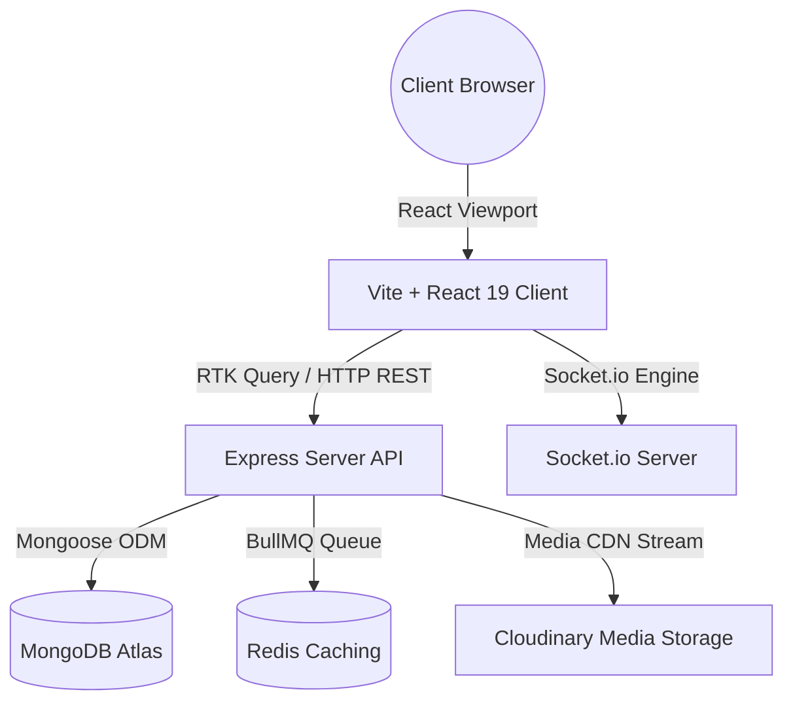

# BizReels System Architecture

This document describes the high-level system architecture of the **BizReels** platform, outlining module partitions, execution threads, and data synchronization triggers.

---

## 1. Modular Layout Overview

The platform uses a decoupled MERN architecture:



### Components Description
- **Vite + React 19 Frontend**: Handles glassmorphic responsive rendering and local state management using Redux Toolkit.
- **Node.js + Express Backend**: Directs endpoint routing, parses security validations (Helmet, Rate Limiter), and initiates database mutations.
- **MongoDB Atlas**: Serves as the primary transaction records database. Leverages 2dsphere geo-indexing for location proximity queries.
- **Redis Cache & BullMQ**: Directs background task dispatching (sponsor boosts expirations, notify schedules).
- **Socket.io**: Broadcaster relaying direct messaging, typing events, read receipts, and live stream chat scrolls.

---

## 2. Layered Coding Standards (MVC & Repository)

To optimize code reuse, maintain clean boundaries, and support test coverage:

```
Request Stream
  │
  ▼
[Routes Layer]        --> Mounts url paths & validates bodies (express-validator)
  │
  ▼
[Controller Layer]    --> Unwraps parameters, invokes matching services
  │
  ▼
[Service Layer]       --> Checks business validation rules, balance holds, triggers sockets
  │
  ▼
[Repository Layer]    --> Performs aggregation pipelines, transaction sessions, and DB reads
  │
  ▼
[Mongoose Schemas]    --> Assert database constraints, validations, and indexes
```

---

## 3. Real-Time WebSockets Sync

Sockets bindings mapping ensures real-time updates without polling:
- **`user:<userId>` room**: Active connection logs that receive quotes bidding updates, collaboration requests, and system alerts.
- **`conversation:<conversationId>` room**: Binds participants. Triggers message deliveries, active typing states, and seen updates.
- **Live Stream room**: Broadcasts comments text scrolling tickers, viewer tally updates, and liked float icons.

---

## 4. Double-Entry Wallet Ledger Escrow Design

To guarantee consistent balance calculations:
- Wallet changes use **Database Sessions Transactions** (`session.withTransaction`).
- Operations require matching opposite ledger entries (e.g. debiting buyer, crediting vendor, and writing transaction logs) to prevent budget leaks.

---

## 5. Modular Subservice & Component Hierarchy Pattern

To prevent architectural decay and monolithic file sprawl as the platform scales:

### Backend: Domain Subservice Isolation
- Highly complex functional domains are divided into subservice directories with clean facade exports (e.g., `services/reel/`, `services/admin/`).
- Routes never execute ad-hoc database aggregations inline; they delegate strictly to domain subservices.
- Cross-cutting concerns (audit logging, telemetry aggregation, WebSocket broadcasts) are encapsulated within domain services.

### Frontend: Lean Orchestrator & Decomposed Subcomponents
- Main page files (e.g., `AdminReelsPage.jsx`) act strictly as thin orchestrators (`< 200` lines) managing route state, tab routing, and query subscriptions.
- Complex user interactions are delegated to dedicated, single-responsibility subcomponents located in a co-located `components/` directory (e.g., `ReelKpiBanner`, `ReelFilterBar`, `ReelTable`, `ReelPreviewModal`, `ReelModerateModal`).
- Client-side utilities and CSV generation are decoupled into pure helper modules (`reelUtils.js`).

---

## 6. Architecture Evolution Strategy: Modular Monolith with Domain-Driven Design (DDD)

While the platform currently operates on an optimized **Layered Monolith**, the recommended target architecture for BizReels' growth stage is a **Modular Monolith with Domain-Driven Design (DDD)**:
- **Why Not Microservices Yet?**: Microservices introduce distributed transactions overhead (complex 2-phase commits for escrow/wallet), network latency between services, deployment overhead (Kubernetes/Docker orchestration), and team coordination friction for a single agile team.
- **Why Modular Monolith?**: It combines the operational simplicity and lightning speed of a single deployable unit with the strict logical boundaries of microservices. Each domain (Reels, Commerce, Wallet, Chat, KYC) maintains its own models, services, and public API facades, allowing individual domains to be extracted into independent microservices in the future with zero code rewrite if traffic demands it.
